# Transaction Creation Flow — Skip Go Client Library

## High-Level Overview

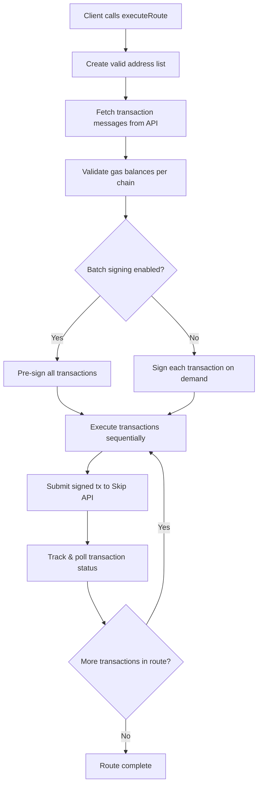

---

## Detailed Flow

### 1. Route Creation (Prerequisite)

Before transaction creation begins, the consumer obtains a `RouteResponse` by calling `route()`, which hits the `/v2/fungible/route` endpoint.

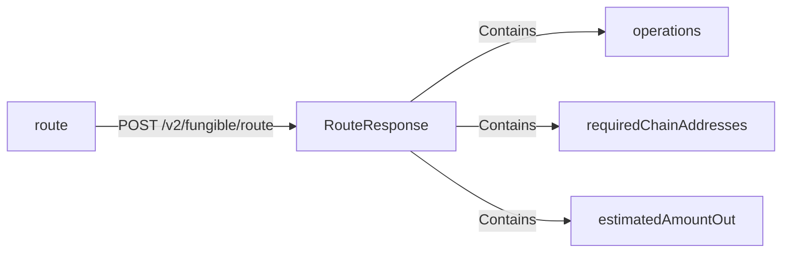

**File:** `packages/client/src/api/postRoute.ts`

---

### 2. executeRoute — Main Entry Point

**File:** `packages/client/src/public-functions/executeRoute.ts`

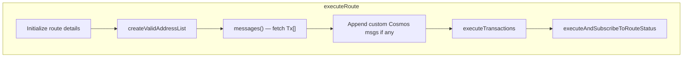

| Step | Method | Purpose |
|------|--------|---------|
| 1 | `updateRouteDetails` | Creates route ID, sets status to `unconfirmed` |
| 2 | `createValidAddressList` | Validates user addresses match required chains |
| 3 | `messages` | Calls `/v2/fungible/msgs` to get chain-specific transactions |
| 4 | `appendCosmosMsgs` | Optional hook to inject additional Cosmos messages |
| 5 | `executeTransactions` | Orchestrates signing and submission |
| 6 | `executeAndSubscribeToRouteStatus` | Runs transactions and polls status |

---

### 3. Address Validation

**File:** `packages/client/src/utils/address.ts`

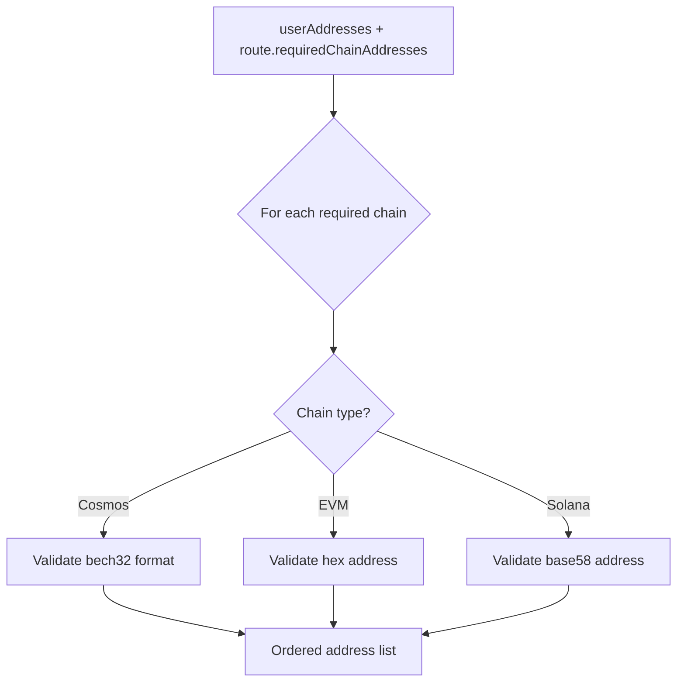

---

### 4. Message Generation

**File:** `packages/client/src/api/postMessages.ts`

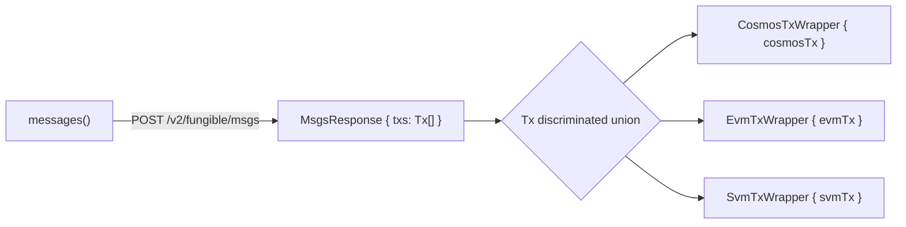

Each `Tx` contains the chain-specific payload:

| Chain | Wrapper | Key Fields |
|-------|---------|------------|
| Cosmos | `CosmosTxWrapper` | `chainId`, `msgs`, `signerAddress`, `fee`, `memo` |
| EVM | `EvmTxWrapper` | `chainId`, `to`, `data`, `value`, `requiredErc20Approvals` |
| Solana | `SvmTxWrapper` | `chainId`, `signerAddress`, `tx` (base64) |

---

### 5. Transaction Execution Orchestration

**File:** `packages/client/src/private-functions/executeTransactions.ts`

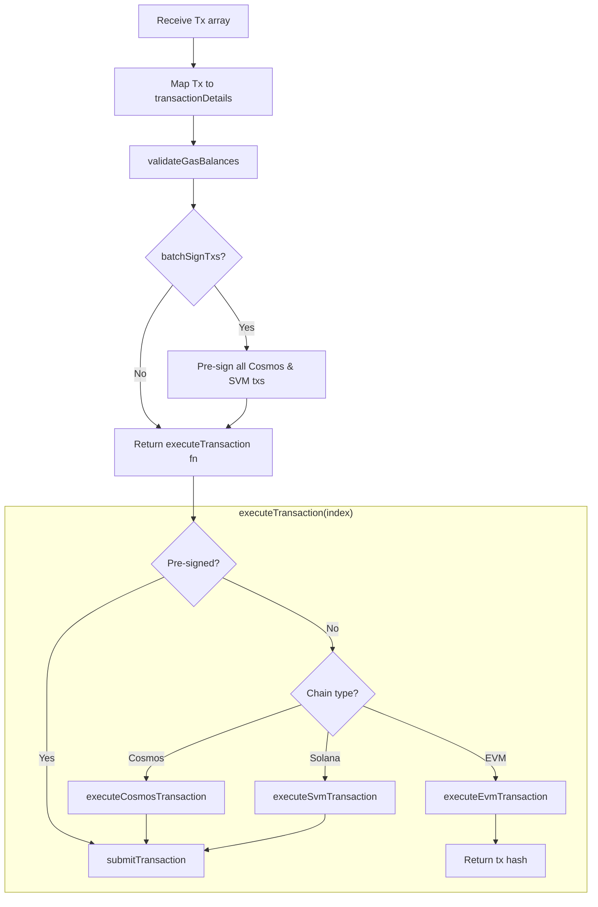

---

### 6. Gas Balance Validation

**File:** `packages/client/src/private-functions/validateGasBalances.ts`

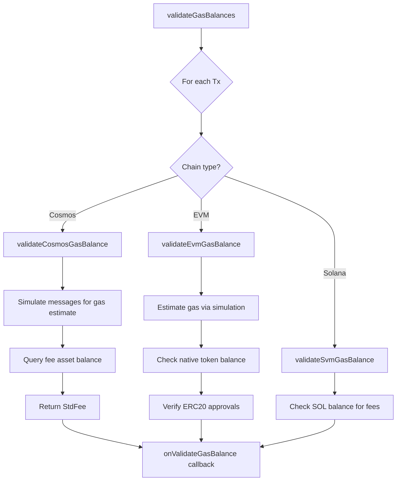

---

### 7. Chain-Specific Execution

#### 7a. Cosmos Transaction

**Files:**
- `packages/client/src/private-functions/cosmos/executeCosmosTransaction.ts`
- `packages/client/src/private-functions/cosmos/signCosmosTransaction.ts`

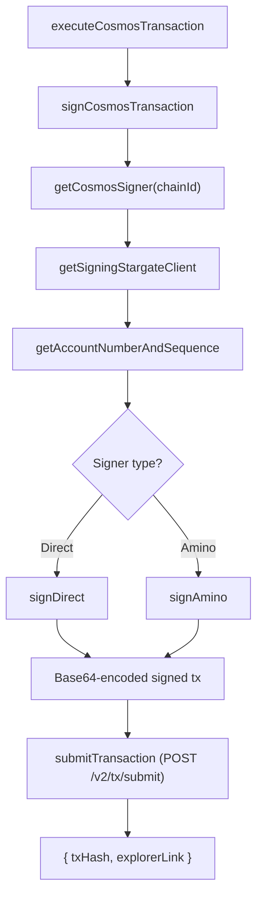

#### 7b. EVM Transaction

**File:** `packages/client/src/private-functions/evm/executeEvmTransaction.ts`

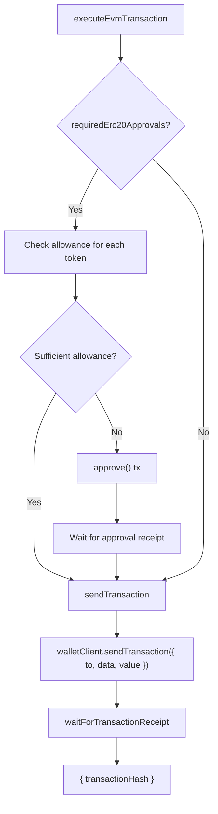

#### 7c. Solana Transaction

**Files:**
- `packages/client/src/private-functions/svm/executeSvmTransaction.ts`
- `packages/client/src/private-functions/svm/signSvmTransaction.ts`

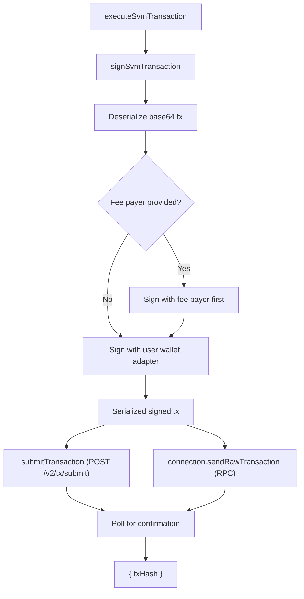

---

### 8. Route Status Subscription

**File:** `packages/client/src/public-functions/subscribeToRouteStatus.ts`

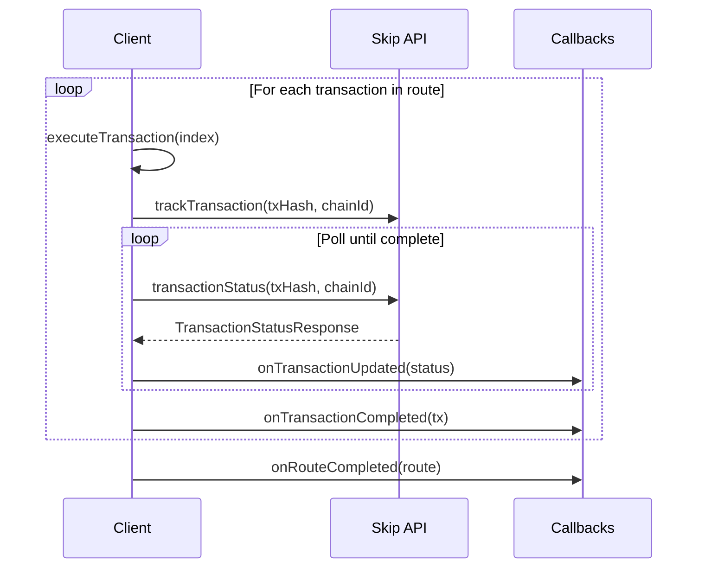

---

## Complete End-to-End Sequence

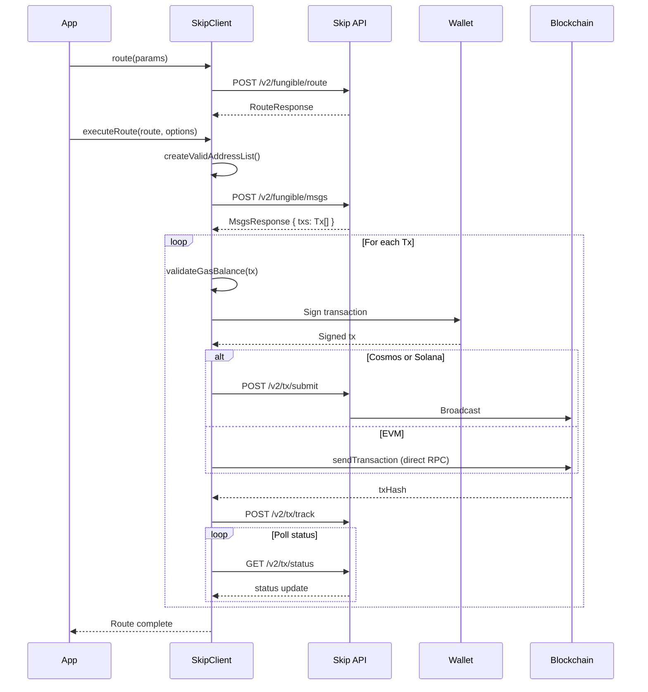

---

## Key Source Files

| File | Purpose |
|------|---------|
| `packages/client/src/public-functions/executeRoute.ts` | Main entry point for transaction execution |
| `packages/client/src/api/postRoute.ts` | Route fetching from API |
| `packages/client/src/api/postMessages.ts` | Transaction message generation |
| `packages/client/src/private-functions/executeTransactions.ts` | Transaction execution orchestration |
| `packages/client/src/private-functions/validateGasBalances.ts` | Gas validation dispatcher |
| `packages/client/src/private-functions/cosmos/executeCosmosTransaction.ts` | Cosmos signing and submission |
| `packages/client/src/private-functions/evm/executeEvmTransaction.ts` | EVM approval + submission |
| `packages/client/src/private-functions/svm/executeSvmTransaction.ts` | Solana signing and submission |
| `packages/client/src/public-functions/subscribeToRouteStatus.ts` | Transaction status polling |
| `packages/client/src/utils/address.ts` | Address validation utilities |
| `packages/client/src/types/swaggerTypes.ts` | Core API type definitions |
