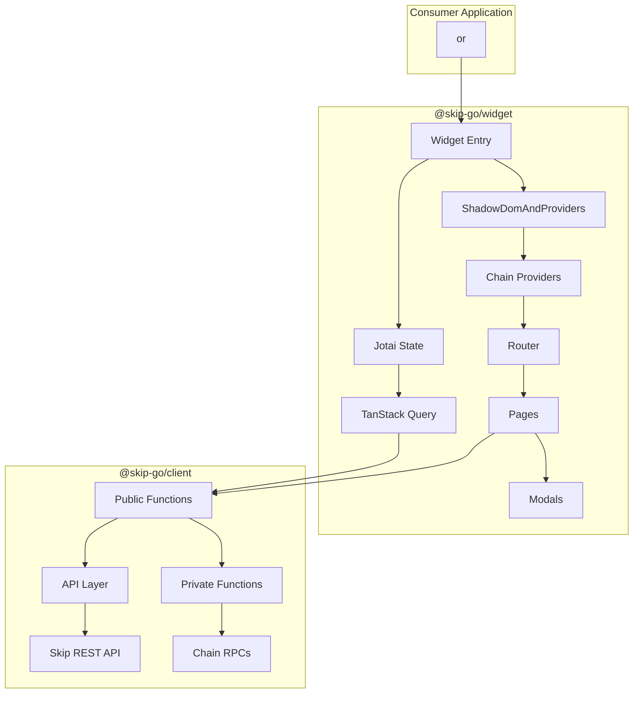
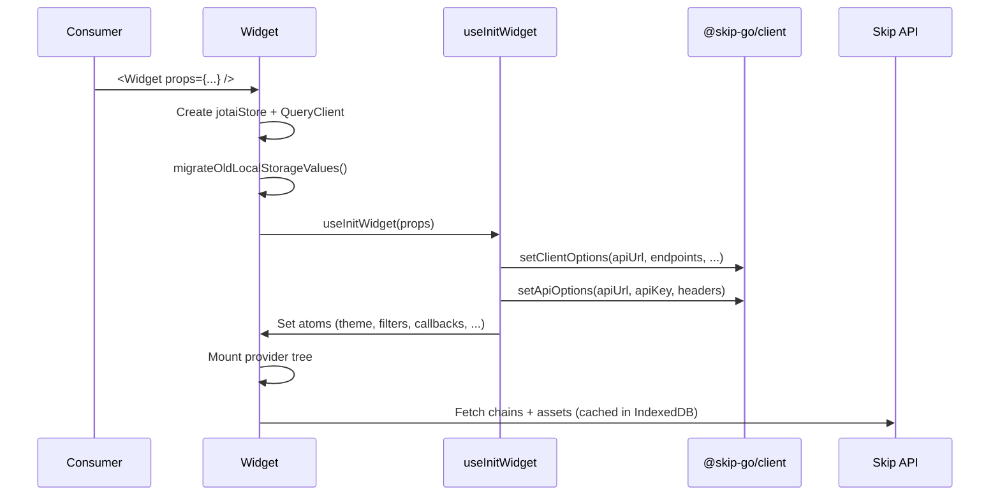
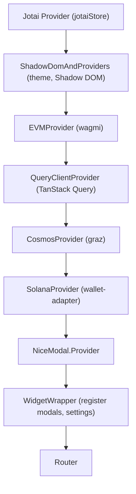
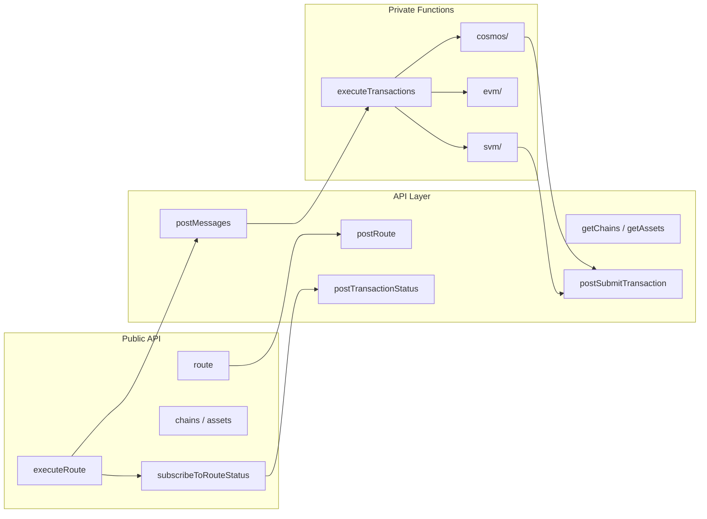
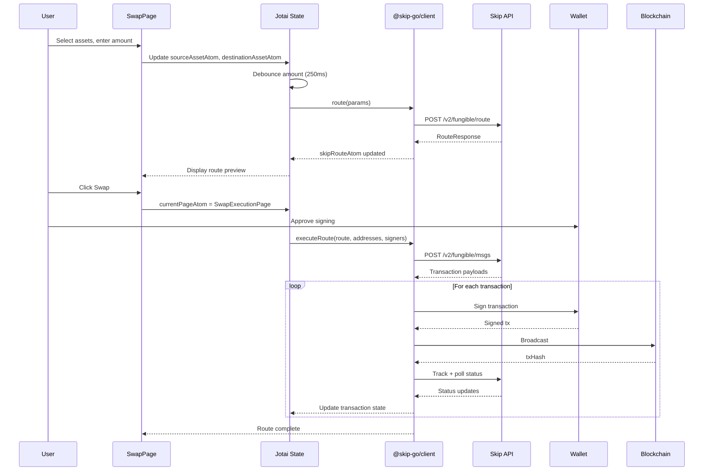

# Architecture Overview — Skip Go

## High-Level Architecture



---

## Package Overview

| Package | npm | Purpose |
|---------|-----|---------|
| `@skip-go/widget` | `packages/widget` | React UI component for cross-chain swaps and transfers |
| `@skip-go/client` | `packages/client` | Headless SDK for interacting with the Skip Go API |

Both packages are published independently. The widget depends on the client.

### Supporting Apps

| App | Path | Purpose |
|-----|------|---------|
| Explorer | `apps/explorer` | Next.js demo app showcasing the widget |
| Next.js Example | `examples/nextjs` | Integration example for Next.js |
| Nuxt.js Example | `examples/nuxtjs` | Integration example for Nuxt.js |
| Client Example | `examples/client` | Headless client usage example |
| Raw HTML | `examples/raw-html.html` | Web component usage example |

---

## Widget Package Architecture

### Entry Points

| Entry | File | Output |
|-------|------|--------|
| React component | `src/index.tsx` | ESM library via Vite |
| Web component | `src/web-component.tsx` | Bundle via Webpack (`<skip-widget>`) |

### Initialization Flow



### Provider Tree

The widget wraps all content in a layered provider tree:



### Routing

The widget uses atom-based routing — no URL router. `currentPageAtom` drives which page renders:

| Route | Page Component | Purpose |
|-------|---------------|---------|
| `SwapPage` | `SwapPage` | Asset selection, amount input, route preview |
| `SwapExecutionPage` | `SwapExecutionPage` | Transaction signing, status tracking |
| `TransactionHistoryPage` | `TransactionHistoryPage` | Past transaction list |

`errorWarningAtom` overrides all routes to show `ErrorWarningPage` when set.

Each page is wrapped in `Suspense` and `ErrorBoundary`.

---

## Client Package Architecture

### Layer Overview



### API Layer (`src/api/`)

Thin wrappers around Skip REST API endpoints. Each file exports a single function that calls `api()` from `generateApi.ts`.

| Function | Endpoint | Method |
|----------|----------|--------|
| `route` | `v2/fungible/route` | POST |
| `messages` | `v2/fungible/msgs` | POST |
| `chains` | `v2/info/chains` | GET |
| `assets` | `v2/fungible/assets` | GET |
| `balances` | `v2/info/balances` | POST |
| `submitTransaction` | `v2/tx/submit` | POST |
| `trackTransaction` | `v2/tx/track` | POST |
| `transactionStatus` | `v2/tx/status` | GET |

### Public Functions (`src/public-functions/`)

Higher-level operations that compose API calls with signing and execution logic.

| Function | Purpose |
|----------|---------|
| `executeRoute` | Full route execution: messages → sign → submit → track |
| `executeMultipleRoutes` | Execute multiple routes in sequence |
| `subscribeToRouteStatus` | Poll transaction status with callbacks |
| `getRouteWithGasOnReceive` | Compute gas-on-receive routes |
| `setClientOptions` | Configure endpoints and registries |
| `setApiOptions` | Configure API URL, key, headers |

### Private Functions (`src/private-functions/`)

Chain-specific signing and execution logic, not exported publicly.

| Directory | Functions |
|-----------|-----------|
| `cosmos/` | `signCosmosTransaction`, `executeCosmosTransaction`, `signCosmosMessageDirect`, `signCosmosMessageAmino` |
| `evm/` | `executeEvmTransaction`, `validateEvmGasBalance`, `validateEvmTokenApproval` |
| `svm/` | `executeSvmTransaction`, `signSvmTransaction`, `validateSvmGasBalance` |

---

## Data Flow: Swap Lifecycle



---

## State Architecture

State is managed through Jotai atoms organized by domain:

| State File | Domain | Key Atoms |
|-----------|--------|-----------|
| `swapPage.ts` | Swap UI | `sourceAssetAtom`, `destinationAssetAtom`, debounced amounts |
| `route.ts` | Route data | `skipRouteAtom`, `routeConfigAtom` |
| `wallets.ts` | Wallets | `evmWalletAtom`, `cosmosWalletAtom`, `svmWalletAtom` |
| `swapExecutionPage.ts` | Execution | `swapExecutionStateAtom`, `chainAddressesAtom` |
| `history.ts` | History | `transactionHistoryAtom`, `currentTransactionAtom` |
| `skipClient.ts` | API data | `skipChainsAtom`, `skipAssetsAtom` |
| `errorWarning.ts` | Errors | `errorWarningAtom` |
| `callbacks.ts` | Events | `callbacksAtom` |

See [State Management](./state_management.md) for details.

---

## Exports

### Widget (`@skip-go/widget`)

```typescript
export { Widget } from "./widget/Widget";
export type { WidgetProps } from "./widget/Widget";
export { defaultTheme, lightTheme } from "./widget/theme";
export type { Theme } from "./widget/theme";
export { resetWidget, setAsset } from "./state/swapPage";
export { openAssetAndChainSelectorModal } from "./modals/AssetAndChainSelectorModal/...";
export { useGetAssetDetails } from "./hooks/useGetAssetDetails";
```

### Client (`@skip-go/client`)

The client exports all API functions, public functions, types, and utilities. Key exports:

- `route`, `messages`, `chains`, `assets`, `balances`
- `executeRoute`, `executeMultipleRoutes`, `subscribeToRouteStatus`
- `setClientOptions`, `setApiOptions`
- Types: `RouteRequest`, `ExecuteRouteOptions`, `SkipClientOptions`, `RouteDetails`, `TransactionDetails`

---

## Key Source Files

| File | Purpose |
|------|---------|
| `packages/widget/src/widget/Widget.tsx` | Widget root, provider tree, jotaiStore |
| `packages/widget/src/widget/Router.tsx` | Page routing, error boundaries |
| `packages/widget/src/widget/ShadowDomAndProviders.tsx` | Shadow DOM, theming |
| `packages/widget/src/widget/useInitWidget.ts` | Props → state initialization |
| `packages/widget/src/index.tsx` | Public exports |
| `packages/widget/src/web-component.tsx` | Web component registration |
| `packages/client/src/index.ts` | Client public exports |
| `packages/client/src/utils/generateApi.ts` | API client factory |
| `packages/client/src/state/apiState.ts` | API configuration singleton |
| `packages/client/src/state/clientState.ts` | Client-side caches |
