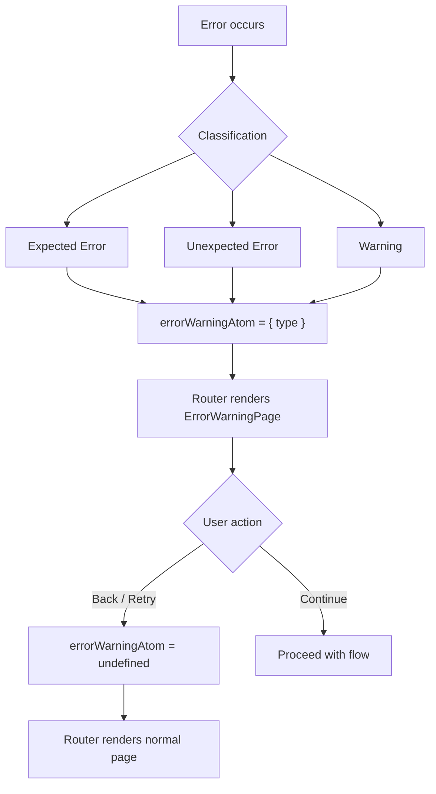
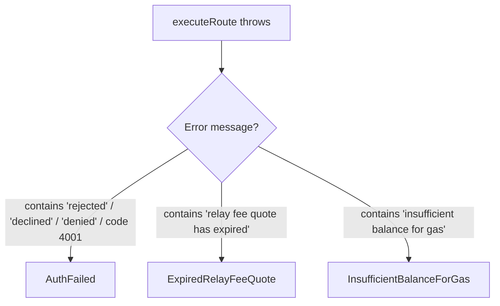
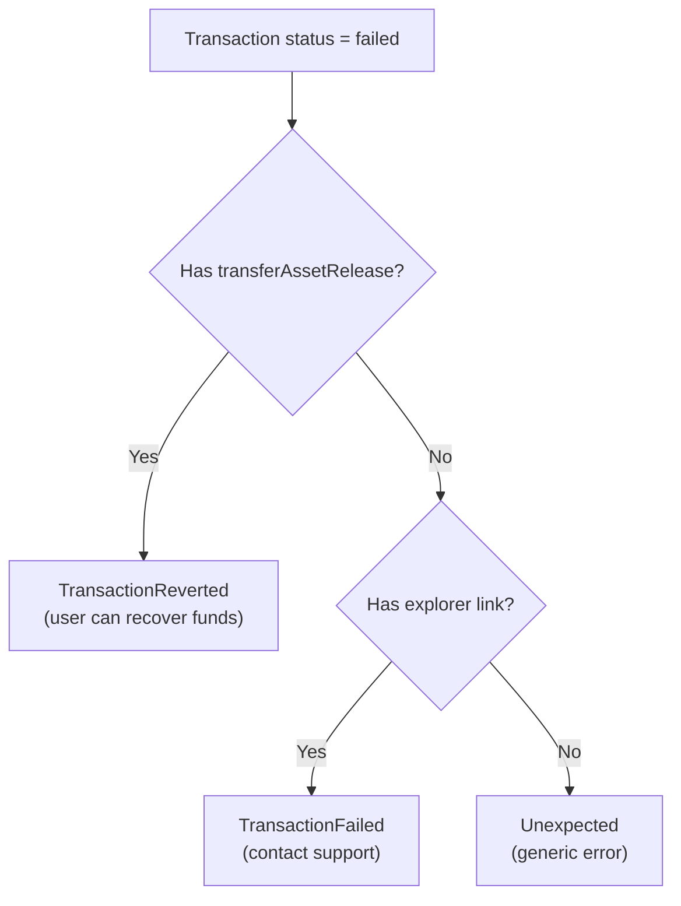
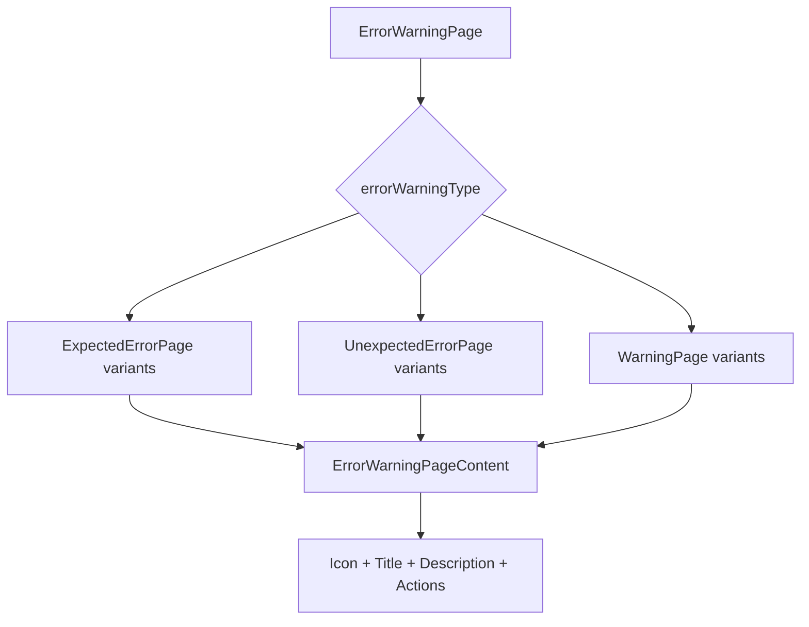

# Error Handling — Skip Go Widget

## Overview

The widget classifies errors into three categories — **expected errors**, **unexpected errors**, and **warnings** — each with distinct UI treatments and recovery flows. A single resettable atom (`errorWarningAtom`) drives the error page, overriding normal routing when set.



---

## Error State

**File:** `packages/widget/src/state/errorWarning.ts`

```typescript
export const errorWarningAtom = atomWithReset<ErrorWarningPageVariants | undefined>(undefined);
```

`ErrorWarningPageVariants` is a discriminated union on `errorWarningType`:

| Type | Category | When |
|------|----------|------|
| `AuthFailed` | Expected | User rejects wallet signing |
| `ExpiredRelayFeeQuote` | Expected | Relay fee quote expired during execution |
| `InsufficientBalanceForGas` | Expected | Wallet lacks gas funds |
| `Timeout` | Unexpected | Route exceeded expected duration |
| `TransactionFailed` | Unexpected | Transaction failed, no recovery asset |
| `TransactionReverted` | Unexpected | Transaction failed with `transferAssetRelease` |
| `Unexpected` | Unexpected | Catch-all for unclassified errors |
| `AdditionalSigningRequired` | Warning | Multi-tx route requires multiple signatures |
| `BadPriceWarning` | Warning | Route has BAD_PRICE_WARNING |
| `LowInfoWarning` | Warning | Route has LOW_INFO_WARNING |
| `GoFastWarning` | Warning | Fast execution mode selected |
| `CosmosLedgerWarning` | Warning | Ledger on Ethermint chains |

When `errorWarningAtom` is set, `Router.tsx` renders `ErrorWarningPage` instead of the current page:

```typescript
if (errorWarning) {
  return <ErrorWarningPage />;
}
```

---

## Error Classification

### Expected Errors

Classified in `swapExecutionPage.ts` during route execution (`onError`):



The `isUserRejectedRequestError` utility in `utils/error.ts` handles wallet-specific rejection messages:

| Wallet | Detection |
|--------|-----------|
| Keplr / MetaMask | Message contains "rejected" |
| Leap | Message contains "declined" or "denied" |
| Generic | Error code `4001` |

### Unexpected Errors

Classified in two locations:

**Transaction timeout** (`useHandleTransactionTimeout.tsx`):
- Triggered when elapsed time exceeds `3 × estimatedRouteDurationSeconds`
- Shows `Timeout` variant with tx hash and explorer link

**Transaction failure** (`useHandleTransactionFailed.tsx`):



**React error boundaries** (`Router.tsx`, `Modal.tsx`):
- All pages and modals are wrapped in `ErrorBoundary`
- Uncaught React errors are caught and set `ErrorWarningType.Unexpected`

### Warnings

Classified before execution begins, in `SwapPage.tsx` and `SwapExecutionButton.tsx`:

| Warning | Trigger | User Choice |
|---------|---------|-------------|
| `AdditionalSigningRequired` | Route has `txsRequired > 1` with `signRequired` transactions | Continue / Back |
| `BadPriceWarning` | Route response contains `warning.type === "BAD_PRICE_WARNING"` | "I know the risk" / Back |
| `LowInfoWarning` | Route response contains `warning.type === "LOW_INFO_WARNING"` | "I know the risk" / Back |
| `GoFastWarning` | Fast route selected and `goFastWarningAtom` is true | Continue / Back |
| `CosmosLedgerWarning` | Cosmos Ledger wallet on Ethermint chains (Injective, Dymension, EVMOS) | Back only |

---

## Error Display

### Page Structure

`ErrorWarningPage` → `ErrorWarningPageContent` provides the shared layout:



### Visual Treatment

| Category | Background Color | Text Color | Icon |
|----------|-----------------|------------|------|
| Expected errors | `theme.warning` or `theme.error` | Matching text color | Warning/error icon |
| Unexpected errors | `theme.error` | `theme.error.text` | Error icon |
| Warnings | `theme.warning` | `theme.warning.text` | Warning icon |

### Page Variants

| Variant | Title | Primary Action | Secondary Action |
|---------|-------|---------------|------------------|
| **AuthFailed** | "Transaction Cancelled" | Back to swap | — |
| **ExpiredRelayFeeQuote** | "Relay Fee Quote Expired" | Retry | — |
| **InsufficientGasBalance** | "Insufficient Gas Balance" | Retry | — |
| **Timeout** | "Transaction Processing" | (auto-clears when resolved) | — |
| **TransactionFailed** | "Transaction Failed" | Contact Support (Discord) | — |
| **TransactionReverted** | "Transaction Reverted" | Continue transaction | Back |
| **Unexpected** | "Unexpected Error" | Retry | — |
| **AdditionalSigningRequired** | "Additional Signing Required" | Continue | Back |
| **BadPriceWarning** | "Bad Price Warning" | "I know the risk, continue anyway" | Back |
| **LowInfoWarning** | "Low Info Warning" | "I know the risk, continue anyway" | Back |
| **GoFastWarning** | "Go Fast" | Continue | Back |
| **CosmosLedgerWarning** | "Cosmos Ledger Warning" | — | Back |

---

## Recovery Flows

### Back / Retry

Most error pages clear `errorWarningAtom` and navigate to `SwapPage`:

```typescript
set(errorWarningAtom, undefined);
set(currentPageAtom, Routes.SwapPage);
```

### Continue (Warnings)

Warning pages clear the error and allow the flow to proceed:

```typescript
// AdditionalSigningRequired
onClickContinue: () => {
  set(errorWarningAtom, undefined);
  // execution continues
}
```

### Transaction Reverted Recovery

When `transferAssetRelease` is available, the user can recover by swapping from the released asset:

```typescript
onClickContinueTransaction: () => {
  setAsset({
    type: "source",
    chainId: transferAssetRelease.chainId,
    denom: transferAssetRelease.denom,
  });
  set(currentPageAtom, Routes.SwapPage);
}
```

### Timeout Auto-Dismiss

`UnexpectedErrorPageTimeout` monitors `lastTransactionInTime` and auto-clears when the transaction status is no longer `"pending"`.

---

## Route Error Handling

**File:** `packages/widget/src/state/route.ts`

Route API errors are handled separately from execution errors:

```typescript
const ROUTE_ERROR_CODE_MAP: Record<number, string> = {
  5: "no route found",
  12: "no route found",
};
```

These are shown inline in the swap page (not via `ErrorWarningPage`). The `skipRouteAtom` catches errors and returns `{ isError: true, error }` for the UI to display.

---

## Error Boundaries

Three layers of error boundaries protect the widget:

| Location | Scope | Behavior |
|----------|-------|----------|
| `Router.tsx` | Each page (SwapPage, SwapExecutionPage, TransactionHistoryPage) | Sets `ErrorWarningType.Unexpected` |
| `Modal.tsx` (`createModal`) | Each modal | Sets `ErrorWarningType.Unexpected` |
| `Widget.tsx` | Entire widget | Outer boundary (prevents crash) |

---

## Callbacks

The `onTransactionFailed` callback fires on any route execution error, before error classification:

```typescript
callbacks?.onTransactionFailed?.({
  error: (error as Error)?.message,
});
```

This ensures consumers always receive failure notifications regardless of how the widget classifies the error.

---

## Where Errors Are Set

| Source File | Error Types Set |
|-------------|-----------------|
| `state/swapExecutionPage.ts` (`onError`) | AuthFailed, ExpiredRelayFeeQuote, InsufficientBalanceForGas |
| `pages/SwapExecutionPage/useHandleTransactionFailed.tsx` | TransactionReverted, TransactionFailed, Unexpected |
| `pages/SwapExecutionPage/useHandleTransactionTimeout.tsx` | Timeout |
| `pages/SwapExecutionPage/SwapExecutionButton.tsx` | AdditionalSigningRequired |
| `pages/SwapPage/SwapPage.tsx` | CosmosLedgerWarning, BadPriceWarning, LowInfoWarning, GoFastWarning |
| `widget/Router.tsx` (ErrorBoundary) | Unexpected |
| `components/Modal.tsx` (createModal ErrorBoundary) | Unexpected |

---

## Key Source Files

| File | Purpose |
|------|---------|
| `packages/widget/src/state/errorWarning.ts` | Error state atom and types |
| `packages/widget/src/utils/error.ts` | `isUserRejectedRequestError` utility |
| `packages/widget/src/constants/routeErrorCodeMap.ts` | API error code mapping |
| `packages/widget/src/pages/ErrorWarningPage/ErrorWarningPage.tsx` | Error page router |
| `packages/widget/src/pages/ErrorWarningPage/ErrorWarningPageContent.tsx` | Shared error page layout |
| `packages/widget/src/pages/ErrorWarningPage/ExpectedErrorPage/` | Expected error variants |
| `packages/widget/src/pages/ErrorWarningPage/UnexpectedErrorPage/` | Unexpected error variants |
| `packages/widget/src/pages/ErrorWarningPage/WarningPage/` | Warning variants |
| `packages/widget/src/state/swapExecutionPage.ts` | Error classification in `onError` |
| `packages/widget/src/pages/SwapExecutionPage/useHandleTransactionFailed.tsx` | Transaction failure classification |
| `packages/widget/src/pages/SwapExecutionPage/useHandleTransactionTimeout.tsx` | Timeout handling |
