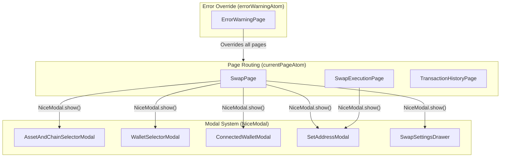
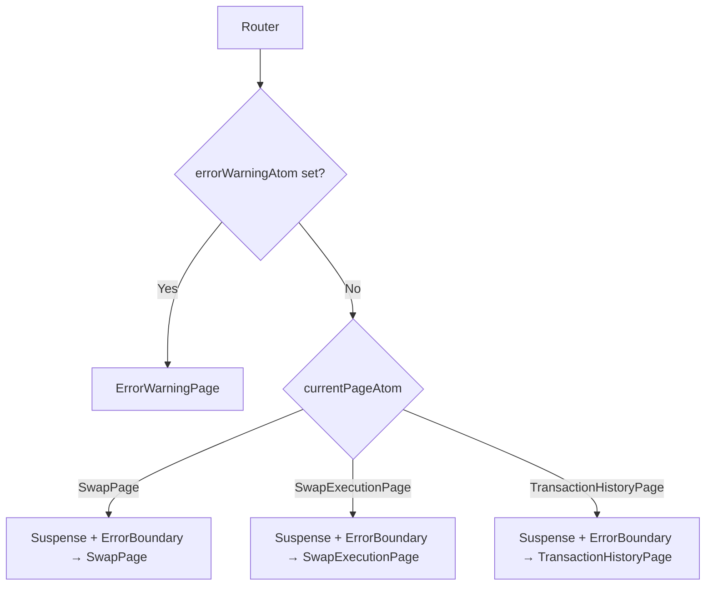
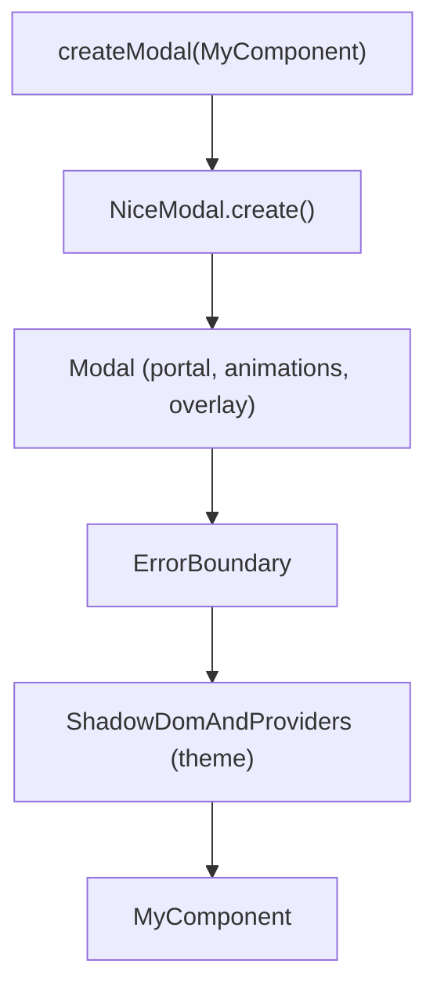

# Modal and UI System — Skip Go Widget

## Overview

The widget uses a combination of atom-based page routing and `@ebay/nice-modal-react` for modals. Pages are full-screen views driven by `currentPageAtom`, while modals overlay the current page for tasks like asset selection, wallet connection, and settings.



---

## Page Routing

### State

**File:** `packages/widget/src/state/router.ts`

```typescript
export enum Routes {
  SwapPage,
  SwapExecutionPage,
  TransactionHistoryPage,
}

export const currentPageAtom = atom<Routes>(Routes.SwapPage);
```

No URL-based router is used. Navigation is done by setting `currentPageAtom`:

```typescript
set(currentPageAtom, Routes.SwapExecutionPage);
```

### Router Component

**File:** `packages/widget/src/widget/Router.tsx`

The router checks `errorWarningAtom` first — if set, it renders `ErrorWarningPage` regardless of the current page. Otherwise, it renders based on `currentPageAtom`:



Each page is wrapped in `Suspense` (for async atoms) and `ErrorBoundary` (catches render errors → sets `ErrorWarningType.Unexpected`).

---

## Pages

### SwapPage

**Files:** `packages/widget/src/pages/SwapPage/`

| File | Purpose |
|------|---------|
| `SwapPage.tsx` | Main layout: header, source/destination inputs, footer |
| `SwapPageHeader.tsx` | Settings gear, history button, connected wallet button |
| `SwapPageAssetChainInput.tsx` | Asset/chain selector + amount input |
| `SwapPageBridge.tsx` | Bridge route indicator between source and destination |
| `SwapPageFooter.tsx` | Route preview, fees, swap button |
| `ConnectedWalletContent.tsx` | Inline connected wallet display |

The swap page opens modals for:
- Asset/chain selection → `AssetAndChainSelectorModal`
- Wallet connection → `WalletSelectorModal` or `ConnectedWalletModal`
- Settings → `SwapSettingsDrawer`

### SwapExecutionPage

**Files:** `packages/widget/src/pages/SwapExecutionPage/`

| File | Purpose |
|------|---------|
| `SwapExecutionPage.tsx` | Execution orchestration and status display |
| `SwapExecutionButton.tsx` | Sign/confirm button with multi-sig warnings |
| `SwapExecutionPageRouteContainer.tsx` | Route visualization container |
| `SwapExecutionPageRouteDetailed.tsx` | Detailed route view (expanded) |
| `SwapExecutionPageRouteDetailedRow.tsx` | Single hop in detailed view |
| `SwapExecutionPageRouteSimple.tsx` | Simplified route view (collapsed) |
| `SwapExecutionPageRouteSimpleRow.tsx` | Single hop in simple view |

Opens `SetAddressModal` when manual address entry is needed for intermediate or destination chains.

### TransactionHistoryPage

**Files:** `packages/widget/src/pages/TransactionHistoryPage/`

| File | Purpose |
|------|---------|
| `TransactionHistoryPage.tsx` | History list with virtual scrolling |
| `TransactionHistoryPageHistoryItem.tsx` | Single history entry |
| `TransactionHistoryPageHistoryItemDetails.tsx` | Expanded history entry details |

### ErrorWarningPage

**Files:** `packages/widget/src/pages/ErrorWarningPage/`

| Directory | Purpose |
|-----------|---------|
| `ExpectedErrorPage/` | AuthFailed, RelayFeeQuoteExpired, InsufficientGasBalance |
| `UnexpectedErrorPage/` | Timeout, TransactionFailed, TransactionReverted, Unexpected |
| `WarningPage/` | AdditionalSigningRequired, BadPrice, LowInfo, GoFast, CosmosLedger |

See [Error Handling](./error_handling.md) for details.

---

## Modal System

### Library

The widget uses [`@ebay/nice-modal-react`](https://github.com/eBay/nice-modal-react) for modal management. It provides:

- Declarative modal registration
- Imperative show/hide API
- Promise-based modal results
- Automatic cleanup

### Registration

**File:** `packages/widget/src/modals/registerModals.ts`

```typescript
export enum Modals {
  AssetAndChainSelectorModal = "AssetAndChainSelectorModal",
  ConnectedWalletModal = "ConnectedWalletModal",
  SetAddressModal = "SetAddressModal",
  SwapSettingsDrawer = "SwapSettingsDrawer",
  WalletSelectorModal = "WalletSelectorModal",
}

export const registerModals = () => {
  NiceModal.register(Modals.AssetAndChainSelectorModal, AssetAndChainSelectorModal);
  NiceModal.register(Modals.ConnectedWalletModal, ConnectedWalletModal);
  NiceModal.register(Modals.SetAddressModal, SetAddressModal);
  NiceModal.register(Modals.SwapSettingsDrawer, SwapSettingsDrawer);
  NiceModal.register(Modals.WalletSelectorModal, WalletSelectorModal);
};
```

`registerModals()` is called in `Widget.tsx` on mount.

### Usage Pattern

```typescript
// Show a modal
NiceModal.show(Modals.AssetAndChainSelectorModal, {
  context: "source",
  onSelect: (asset) => { /* handle selection */ },
});

// Hide a modal
NiceModal.hide(Modals.AssetAndChainSelectorModal);

// Remove a modal (hide + cleanup)
NiceModal.remove(Modals.AssetAndChainSelectorModal);
```

### Creating Modals with `createModal`

**File:** `packages/widget/src/components/Modal.tsx`

The `createModal<T>` factory wraps a component with the `Modal` chrome, `ErrorBoundary`, and `NiceModal.create()`:



Features:
- Renders via `createPortal` into `container` prop or `document.body`
- Wraps content in `ShadowDomAndProviders` for theme inheritance
- Escape key and click-outside close behavior
- Two animation modes: **modal** (fade + zoom) and **drawer** (slide up)
- `ErrorBoundary` catches errors and sets `ErrorWarningType.Unexpected`

---

## Modal Details

### AssetAndChainSelectorModal

**Directory:** `packages/widget/src/modals/AssetAndChainSelectorModal/`

Allows users to search and select assets or chains.

| Prop | Type | Purpose |
|------|------|---------|
| `context` | `"source" \| "destination"` | Which side of the swap |
| `onSelect` | `(asset) => void` | Selection callback |
| `selectedAsset` | `Asset` | Currently selected asset |
| `selectChain` | `boolean` | Chain-only selection mode |
| `onlySelectChain` | `boolean` | Restrict to chain selection |

Features:
- Virtual scrolling for large asset lists
- Search by name, symbol, or denom
- Assets grouped by `recommendedSymbol`
- IBC Eureka asset highlighting
- Respects `filterAtom`, `filterOutAtom`, `filterOutUnlessUserHasBalanceAtom`

Also exported as an imperative function:

```typescript
openAssetAndChainSelectorModal({ context: "source", onSelect: (asset) => {} });
```

### WalletSelectorModal

**Directory:** `packages/widget/src/modals/WalletSelectorModal/`

Displays available wallets for connection.

| Prop | Type | Purpose |
|------|------|---------|
| `chainId` | `string` | Target chain for connection |
| `chainType` | `ChainType` | Chain type (cosmos/evm/svm) |
| `fromConnectedWalletModal` | `boolean` | Whether navigated from ConnectedWalletModal |

Uses `RenderWalletList` component to display wallets by ecosystem (Cosmos, EVM, Solana).

### ConnectedWalletModal

**Directory:** `packages/widget/src/modals/ConnectedWalletModal/`

Shows connected wallet status across all ecosystems.

Displays `EcosystemConnectors` with rows for Cosmos, EVM, and Solana. Each row shows:
- Wallet name and icon
- Connected address (truncated, copyable)
- Connect/disconnect actions

### SetAddressModal

**Directory:** `packages/widget/src/modals/SetAddressModal/`

Manual address entry for intermediate or destination chains.

| Prop | Type | Purpose |
|------|------|---------|
| `chainId` | `string` | Target chain |
| `chainAddressIndex` | `number` | Index in the chain address list |
| `signRequired` | `boolean` | Whether signing is needed for this chain |
| `isGasRoute` | `boolean` | Whether this is for a gas-on-receive route |

Two modes:
1. **Wallet list** — Connect a wallet for the target chain
2. **Manual input** — Enter an address directly

Validates addresses using chain-specific validation:
- Cosmos: bech32 format check
- EVM: `isAddress` from viem
- Solana: `PublicKey` validation

### SwapSettingsDrawer

**Directory:** `packages/widget/src/modals/SwapSettingsDrawer/`

Drawer-style modal (slides up from bottom) for swap configuration.

Displays:
- Route details (operations, bridges)
- Price impact
- Estimated fees
- Route preference selector (fastest/cheapest)
- Slippage selector
- Links to Terms of Service and Privacy Policy

---

## Core UI Components

**Directory:** `packages/widget/src/components/`

### Layout Components

| Component | Purpose |
|-----------|---------|
| `Container` | Main widget container with background |
| `Layout` | Content area with padding and scrolling |
| `PageHeader` | Page-level header with back button |

### Interactive Components

| Component | Purpose |
|-----------|---------|
| `Button` | Primary styled button |
| `MainButton` | Full-width action button (swap, confirm, etc.) |
| `Switch` | Toggle switch |
| `Tooltip` / `QuestionMarkTooltip` | Hover tooltips |

### Display Components

| Component | Purpose |
|-----------|---------|
| `Typography` | Styled text with variants |
| `Skeleton` | Loading placeholder with shimmer animation |
| `GroupedAssetImage` | Stacked asset icons for grouped tokens |
| `GasOnReceive` | Gas-on-receive indicator |
| `GoFastSymbol` | Fast execution badge |
| `EvmDisclaimer` | EVM-specific disclaimer text |

### List Components

| Component | Purpose |
|-----------|---------|
| `VirtualList` | Virtualized scrolling list for large datasets |
| `RenderWalletList` | Wallet list with ecosystem grouping |
| `ModalRowItem` | Standard row item for modal lists |

---

## Animation Patterns

### Modal Animations

```
Open:  opacity 0→1, scale 0.96→1 (200ms ease-out)
Close: opacity 1→0, scale 1→0.96 (150ms ease-in)
```

### Drawer Animations

```
Open:  translateY(100%)→0 (300ms ease-out)
Close: translateY(0)→100% (200ms ease-in)
```

### Overlay

Semi-transparent backdrop with blur effect. Clicking the overlay closes the modal (unless `disableCloseOnClickOutside` is set).

---

## Key Source Files

| File | Purpose |
|------|---------|
| `packages/widget/src/widget/Router.tsx` | Page routing |
| `packages/widget/src/state/router.ts` | `currentPageAtom`, `Routes` enum |
| `packages/widget/src/components/Modal.tsx` | `Modal` component, `createModal` factory |
| `packages/widget/src/components/ModalHeader.tsx` | Modal header with back button |
| `packages/widget/src/components/ModalRowItem.tsx` | Standard modal row item |
| `packages/widget/src/modals/registerModals.ts` | Modal registration, `Modals` enum |
| `packages/widget/src/modals/AssetAndChainSelectorModal/` | Asset/chain selector |
| `packages/widget/src/modals/WalletSelectorModal/` | Wallet selector |
| `packages/widget/src/modals/ConnectedWalletModal/` | Connected wallet display |
| `packages/widget/src/modals/SetAddressModal/` | Manual address entry |
| `packages/widget/src/modals/SwapSettingsDrawer/` | Settings drawer |
| `packages/widget/src/pages/SwapPage/` | Main swap page |
| `packages/widget/src/pages/SwapExecutionPage/` | Transaction execution page |
| `packages/widget/src/pages/TransactionHistoryPage/` | Transaction history page |
| `packages/widget/src/pages/ErrorWarningPage/` | Error/warning page variants |
