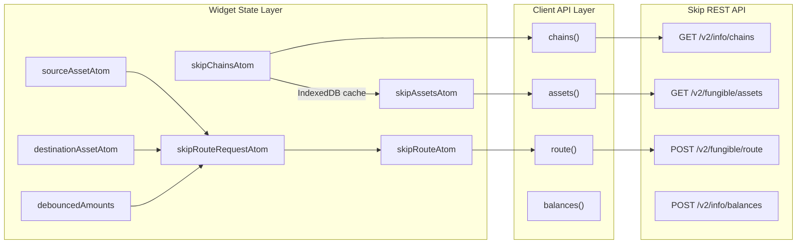
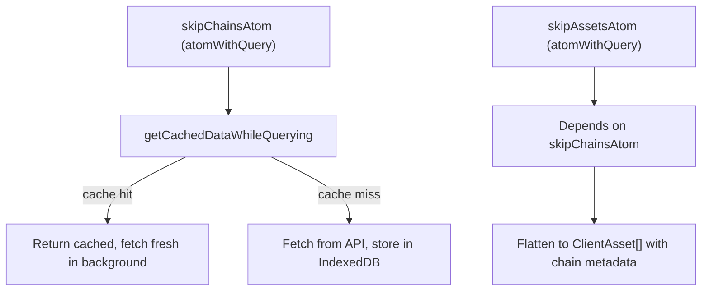
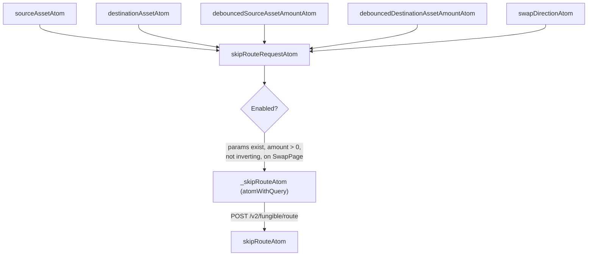
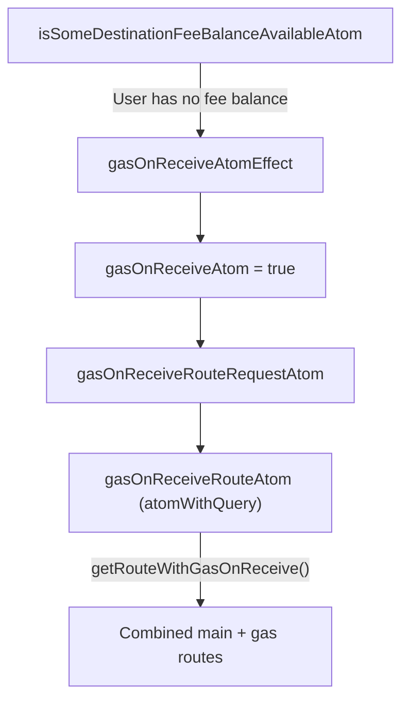
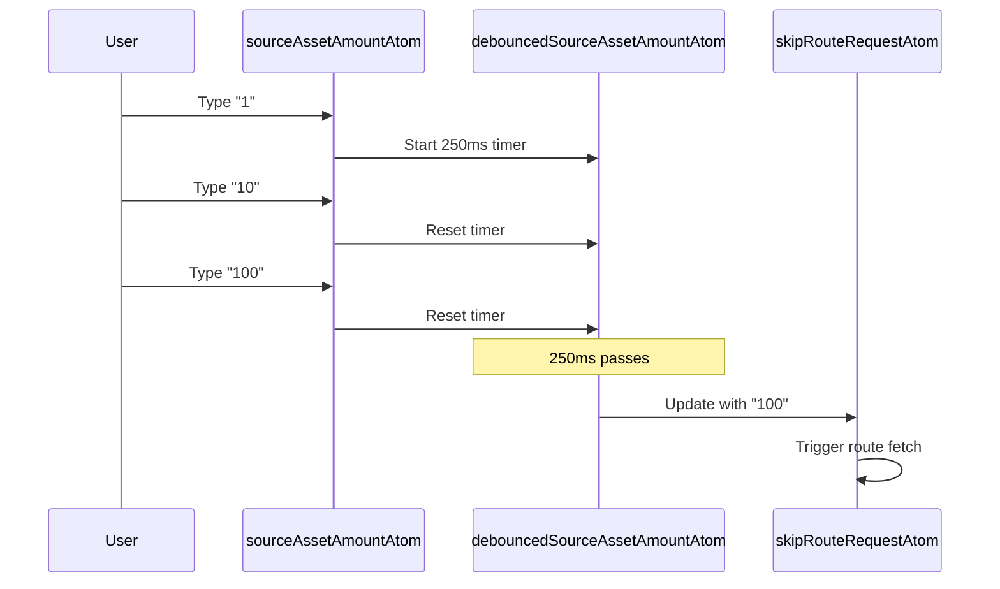

# Route and Asset Fetching — Skip Go

## Overview

The Skip Go API provides chain metadata, asset catalogs, and cross-chain route computation. The client package wraps these endpoints, and the widget consumes them through Jotai atoms backed by TanStack Query with IndexedDB caching.



---

## Client API Functions

### Chain Fetching

**File:** `packages/client/src/api/getChains.ts`

```typescript
const chainsData = await chains({
  includeEvm: true,
  includeSvm: true,
});
```

| Parameter | Type | Purpose |
|-----------|------|---------|
| `includeEvm` | `boolean` | Include EVM chains |
| `includeSvm` | `boolean` | Include Solana chains |

Caches result in `ClientState.skipChains` when both EVM and SVM are included.

### Asset Fetching

**File:** `packages/client/src/api/getAssets.ts`

```typescript
const assetsData = await assets({
  includeEvmAssets: true,
  includeSvmAssets: true,
  includeCw20Assets: true,
});
// Returns: Record<chainId, Asset[]>
```

The response `chainToAssetsMap` is transformed to a flat `Record<string, Asset[]>`. Cached in `ClientState.skipAssets` when all asset types are included.

### Route Fetching

**File:** `packages/client/src/api/postRoute.ts`

```typescript
const routeResponse = await route({
  sourceAssetChainId: "cosmoshub-4",
  sourceAssetDenom: "uatom",
  destAssetChainId: "osmosis-1",
  destAssetDenom: "uosmo",
  amountIn: "1000000",
  // or amountOut for reverse quotes
});
```

| Key Fields | Purpose |
|-----------|---------|
| `sourceAssetChainId`, `sourceAssetDenom` | Source asset identifier |
| `destAssetChainId`, `destAssetDenom` | Destination asset identifier |
| `amountIn` or `amountOut` | Input or output amount (mutually exclusive) |
| `smartRelay` | Enable smart relaying |
| `goFast` | Enable fast execution path |
| `allowMultiTx` | Allow routes requiring multiple transactions |
| `allowUnsafe` | Allow routes with higher risk |
| `experimentalFeatures` | Enable experimental bridges (eureka, layer_zero, stargate, hyperlane) |
| `bridges` | Filter to specific bridge IDs |
| `swapVenues` | Filter to specific swap venues |

The function automatically adds `cumulativeAffiliateFeeBps` from `ApiState`.

### Balance Fetching

**File:** `packages/client/src/api/postBalances.ts`

```typescript
const balanceData = await balances({
  chains: { "cosmoshub-4": { address: "cosmos1...", denoms: ["uatom"] } },
});
```

### Additional API Functions

| Function | Endpoint | Purpose | Used in Widget |
|----------|----------|---------|----------------|
| `assetsBetweenChains` | `POST v2/fungible/assets_between_chains` | Assets transferable between two chains | No |
| `recommendAssets` | `POST v2/fungible/recommend_assets` | Asset recommendations for a pair | No |
| `assetsFromSource` | `POST v2/fungible/assets_from_source` | Destination assets reachable from a source | No |
| `ibcOriginAssets` | `POST v2/fungible/ibc_origin_assets` | Original denominations for IBC assets | No |

These are exported for external consumers but not used by the widget itself.

---

## Widget State Layer

### Chain and Asset Loading

**File:** `packages/widget/src/state/skipClient.ts`

Both chains and assets are loaded as `atomWithQuery` atoms with IndexedDB caching:



`ClientAsset` extends `Asset` with `chain_key` and `chainName` from the chains data.

### Asset Selection

Assets are displayed in the `AssetAndChainSelectorModal`, grouped by `recommendedSymbol`. Three filter atoms control visibility:

| Filter Atom | Purpose |
|-------------|---------|
| `filterAtom` | Only show assets matching `{ source: { chainId: [denoms] }, destination: { ... } }` |
| `filterOutAtom` | Hide specific assets |
| `filterOutUnlessUserHasBalanceAtom` | Hide unless user has a balance |

### Route Request Construction

**File:** `packages/widget/src/state/route.ts`



The `skipRouteRequestAtom` derives the request params:

- Uses `amountIn` when `swapDirection === "swap-in"`, `amountOut` when `"swap-out"`
- Converts human-readable amounts to crypto amounts using asset decimals
- The query is enabled only when all required params are present, amount > 0, not inverting, and on SwapPage

### Route Query Configuration

| Setting | Value |
|---------|-------|
| Retry | 1 |
| Refetch interval | 30 seconds |
| Stale time | 0 (always refetch) |

### Route Error Handling

Error codes from the API are mapped to user-friendly messages:

```typescript
// packages/widget/src/constants/routeErrorCodeMap.ts
export const ROUTE_ERROR_CODE_MAP: Record<number, string> = {
  5: "no route found",
  12: "no route found",
};
```

`skipRouteAtom` wraps `_skipRouteAtom` and normalizes errors, returning `{ data, isError, error }`.

---

## Swap Direction

The widget supports both "swap-in" (specify input amount) and "swap-out" (specify output amount):

| Direction | User edits | Route param | Opposite amount |
|-----------|-----------|-------------|-----------------|
| `swap-in` | Source amount | `amountIn` | Destination set from `route.estimatedAmountOut` |
| `swap-out` | Destination amount | `amountOut` | Source set from `route.estimatedAmountIn` |

`useUpdateAmountWhenRouteChanges` syncs the non-edited amount when the route response arrives.

---

## Gas-on-Receive

**File:** `packages/widget/src/state/gasOnReceive.ts`

When the destination chain's native fee token isn't the swapped asset, the widget can automatically add a gas route:



**Conditions for gas-on-receive:**
- On SwapExecutionPage
- Destination asset is not a fee asset
- Destination chain is Cosmos or EVM (not Solana or Ethereum mainnet)
- No active transaction in progress

`getRouteWithGasOnReceive` (client) computes gas amounts, requests separate gas routes, and validates they're compatible with the main route.

---

## Amount Debouncing

Amount inputs are debounced at 250ms to avoid excessive route requests:



`isWaitingForNewRouteAtom` combines `isDebouncingAtom` and query loading state to drive UI loading indicators.

---

## API Client Configuration

**File:** `packages/client/src/utils/generateApi.ts`

All API functions use a shared request client created by `createRequestClient`:

| Config | Default | Source |
|--------|---------|--------|
| `apiUrl` | `https://go.skip.build/api/skip` | `setApiOptions()` |
| `apiKey` | — | Passed as `Authorization` header |
| `apiHeaders` | — | Custom headers |

Request/response bodies are automatically converted between camelCase (TypeScript) and snake_case (API).

---

## Key Source Files

| File | Purpose |
|------|---------|
| `packages/client/src/api/postRoute.ts` | Route fetching |
| `packages/client/src/api/getAssets.ts` | Asset catalog |
| `packages/client/src/api/getChains.ts` | Chain catalog |
| `packages/client/src/api/postBalances.ts` | Balance queries |
| `packages/client/src/public-functions/getRouteWithGasOnReceive.ts` | Gas-on-receive logic |
| `packages/client/src/utils/generateApi.ts` | API client factory |
| `packages/widget/src/state/skipClient.ts` | Chains/assets atoms with IndexedDB cache |
| `packages/widget/src/state/route.ts` | Route state and query |
| `packages/widget/src/state/swapPage.ts` | Swap inputs, debouncing, direction |
| `packages/widget/src/state/gasOnReceive.ts` | Gas-on-receive state |
| `packages/widget/src/state/filters.ts` | Asset filter atoms |
| `packages/widget/src/state/balances.ts` | Balance query atoms |
| `packages/widget/src/constants/routeErrorCodeMap.ts` | API error code mapping |
