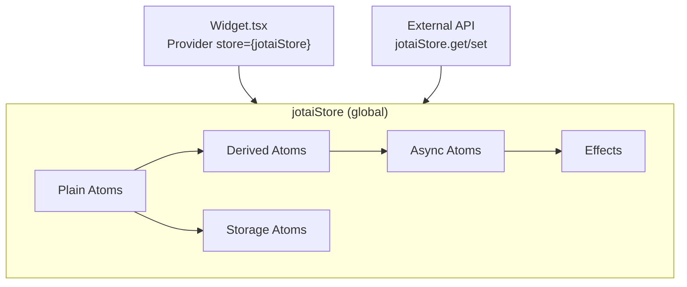
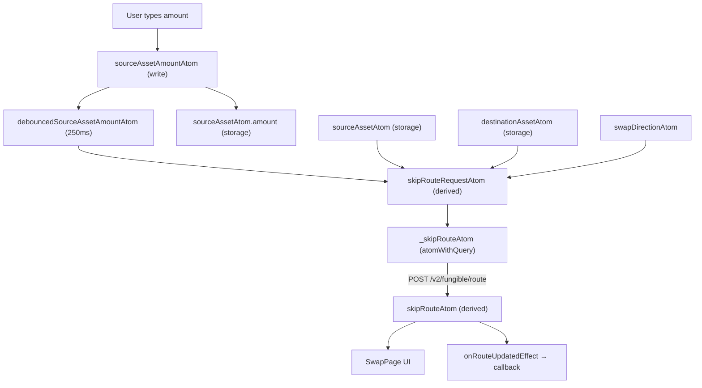

# State Management — Skip Go Widget

## Overview

The widget uses [Jotai](https://jotai.org/) for state management. All atoms live in `packages/widget/src/state/` and are organized by domain. A single global store (`jotaiStore`) is created in `Widget.tsx` and shared across the app.



---

## Atom Patterns

### Plain Atoms

Basic state containers with an initial value.

```typescript
import { atom } from "jotai";

export const currentPageAtom = atom<Routes>(Routes.SwapPage);
export const filterAtom = atom<ChainFilter>();
```

**Used for:** UI state (current page, filters, wallet references, settings drawer ref).

### Derived Atoms (Read-only)

Compute values from other atoms. Re-evaluate when dependencies change.

```typescript
const skipRouteRequestAtom = atom((get) => {
  const sourceAsset = get(sourceAssetAtom);
  const destinationAsset = get(destinationAssetAtom);
  const direction = get(swapDirectionAtom);
  // ... build request from dependencies
  return requestParams;
});
```

**Used for:** Route request params, sorted history, combined wallet state.

### Write-only Atoms

Actions that update other atoms without holding state themselves.

```typescript
const clearAssetInputAmountsAtom = atom(null, (get, set) => {
  set(debouncedSourceAssetAmountAtom, "");
  set(debouncedDestinationAssetAmountAtom, "");
});
```

**Used for:** `invertSwapAtom`, `setTransactionHistoryAtom`, `setSwapExecutionStateAtom`.

### Resettable Atoms

Atoms that can be reset to their initial value with `useResetAtom`.

```typescript
import { atomWithReset } from "jotai/utils";

export const errorWarningAtom = atomWithReset<ErrorWarningPageVariants | undefined>(undefined);
```

**Used for:** Error/warning state that needs to be cleared.

### Storage Atoms

Persist state to localStorage. Two variants are used:

#### Standard (`atomWithStorage`)

```typescript
import { atomWithStorage } from "jotai/utils";

export const transactionHistoryAtom = atomWithStorage<TransactionHistoryItem[]>(
  LOCAL_STORAGE_KEYS.transactionHistory, []
);
```

#### Without Cross-Tab Sync (`atomWithStorageNoCrossTabSync`)

Avoids performance overhead of `BroadcastChannel` for frequently-updated values.

```typescript
import { atomWithStorageNoCrossTabSync } from "@/utils/storage";

export const sourceAssetAtom = atomWithStorageNoCrossTabSync<SourceAsset>(
  LOCAL_STORAGE_KEYS.sourceAsset, {}
);
```

**Used for:** source/destination assets, swap settings, swap execution state, wallet deep links.

#### IndexedDB Storage

For large cached datasets (chains, assets, bridges, venues):

```typescript
const skipChainsAtom = atomWithQuery((get) => ({
  queryKey: ["skipChains", ...],
  queryFn: async () => {
    const cached = await getCachedDataWhileQuerying("chains", ...);
    const fresh = await chains({ ... });
    await setIndexedDBItem("chains", fresh);
    return fresh;
  },
}));
```

**Used in:** `skipClient.ts` for `skipChainsAtom`, `skipAssetsAtom`, `skipBridgesAtom`, `skipSwapVenuesAtom`.

### Async Atoms (`atomWithQuery` / `atomWithMutation`)

Integration with TanStack Query for data fetching and mutations.

```typescript
import { atomWithQuery, atomWithMutation } from "jotai-tanstack-query";

const _skipRouteAtom = atomWithQuery((get) => ({
  queryKey: ["skipRoute", params],
  queryFn: async () => route({ ...params }),
  enabled: Boolean(params) && amount > 0,
  retry: 1,
  refetchInterval: 30_000,
}));

const skipSubmitSwapExecutionAtom = atomWithMutation(() => ({
  mutationFn: async (params) => executeRoute(params),
  onSuccess: () => { /* ... */ },
  onError: (error) => { /* classify and set errorWarningAtom */ },
}));
```

### Debounced Atoms (`atomWithDebounce`)

Custom factory for input debouncing. Returns a set of coordinated atoms:

```typescript
const { debouncedValueAtom, currentValueAtom, isDebouncingAtom, clearTimeoutAtom } =
  atomWithDebounce("", 250);
```

| Returned Atom | Type | Purpose |
|---------------|------|---------|
| `currentValueAtom` | Read-only | Current (un-debounced) value |
| `debouncedValueAtom` | Write-only | Setter that debounces updates |
| `isDebouncingAtom` | Read-only | Whether a debounce is pending |
| `clearTimeoutAtom` | Write-only | Cancel pending debounce |

The setter accepts `(update, callback?, immediate?)` — passing `immediate: true` bypasses the debounce.

**Used for:** `debouncedSourceAssetAmountAtom`, `debouncedDestinationAssetAmountAtom` in `swapPage.ts`.

### Effect Atoms (`atomEffect`)

Side effects that run when dependencies change. From the `jotai-effect` package.

```typescript
import { atomEffect } from "jotai-effect";

const onRouteUpdatedEffect = atomEffect((get) => {
  const callbacks = get(callbacksAtom);
  const route = get(skipRouteAtom);
  if (route.data) {
    callbacks?.onRouteUpdated?.({ ... });
  }
});
```

| Effect | File | Purpose |
|--------|------|---------|
| `onRouteUpdatedEffect` | `swapPage.ts` | Fires `onRouteUpdated` callback when route changes |
| `preloadSigningStargateClientEffect` | `swapPage.ts` | Preloads Cosmos signing client for source chain |
| `gasRouteAddressesAtomEffect` | `swapExecutionPage.ts` | Syncs gas route addresses from main chain addresses |
| `gasRouteEffect` | `swapExecutionPage.ts` | Updates execution state with main/gas route |
| `userAddressesEffectAtom` | `swapExecutionPage.ts` | Writes resolved user addresses into execution state |
| `gasRouteUserAddressesEffectAtom` | `swapExecutionPage.ts` | Same for gas route addresses |
| `gasOnReceiveAtomEffect` | `gasOnReceive.ts` | Sets gas-on-receive flag based on destination fee balance |
| `initializeDebounceValuesEffect` | `route.ts` | Syncs debounced amounts with stored assets on init |

---

## State Organization

### State Files

| File | Domain | Key Atoms |
|------|--------|-----------|
| `swapPage.ts` | Swap UI inputs | `sourceAssetAtom`, `destinationAssetAtom`, debounced amounts, `swapDirectionAtom`, `swapSettingsAtom` |
| `route.ts` | Route fetching | `skipRouteRequestAtom`, `skipRouteAtom`, `routeConfigAtom`, `defaultRouteAtom` |
| `wallets.ts` | Wallet state | `evmWalletAtom`, `cosmosWalletAtom`, `svmWalletAtom`, `walletsAtom` |
| `swapExecutionPage.ts` | Tx execution | `swapExecutionStateAtom`, `chainAddressesAtom`, `skipSubmitSwapExecutionAtom` |
| `history.ts` | Tx history | `transactionHistoryAtom`, `currentTransactionAtom`, `sortedHistoryItemsAtom` |
| `skipClient.ts` | API data cache | `skipChainsAtom`, `skipAssetsAtom`, `skipClientConfigAtom` |
| `balances.ts` | Balances | `skipAllBalancesAtom`, `skipAllBalancesRequestAtom` |
| `gasOnReceive.ts` | Gas-on-receive | `gasOnReceiveAtom`, `gasOnReceiveRouteAtom` |
| `errorWarning.ts` | Error display | `errorWarningAtom` |
| `callbacks.ts` | Event callbacks | `callbacksAtom` |
| `router.ts` | Navigation | `currentPageAtom` |
| `filters.ts` | Asset filtering | `filterAtom`, `filterOutAtom`, `filterOutUnlessUserHasBalanceAtom` |
| `settingsDrawer.ts` | UI ref | `settingsDrawerAtom` |
| `types.ts` | Enums | `RoutePreference` |
| `localStorageKeys.ts` | Storage keys | `LOCAL_STORAGE_KEYS` enum |

### Local Storage Keys

```typescript
enum LOCAL_STORAGE_KEYS {
  sourceAsset = "sourceAsset",
  destinationAsset = "destinationAsset",
  transactionHistory = "transactionHistory",
  transactionHistoryVersion = "transactionHistoryVersion",
  swapExecutionState = "swapExecutionState",
  extraCosmosChainIdsToConnectPerWallet = "extraCosmosChainIdsToConnectPerWallet",
}
```

---

## Data Flow: Swap Page



---

## External Store Access

The `jotaiStore` is exported from `packages/widget/src/jotai.ts`, enabling imperative state access outside React:

```typescript
import { jotaiStore } from "@skip-go/widget";

// Used by:
// - resetWidget() / setAsset() in swapPage.ts
// - migrateOldLocalStorageValues() at startup
// - History migration utilities
// - Explorer link generation
```

---

## Storage Migration

`migrateOldLocalStorageValues()` runs at widget initialization:

1. Converts snake_case localStorage keys to camelCase
2. Filters invalid transaction history items
3. Runs versioned history migrations (`updateHistoryFromCamelCaseToRouteDetails`, `updateHistoryFromRouteDetailsToUserAddresses`)
4. Updates `transactionHistoryVersionAtom`

---

## Key Source Files

| File | Purpose |
|------|---------|
| `packages/widget/src/state/*.ts` | All atom definitions |
| `packages/widget/src/utils/atomWithDebounce.ts` | Debounce atom factory |
| `packages/widget/src/utils/storage.ts` | `atomWithStorageNoCrossTabSync`, IndexedDB helpers |
| `packages/widget/src/utils/migrateOldLocalStorageValues.ts` | Storage migration logic |
| `packages/widget/src/jotai.ts` | `jotaiStore` export |
| `packages/widget/src/widget/Widget.tsx` | Store creation, `Provider` mount |
