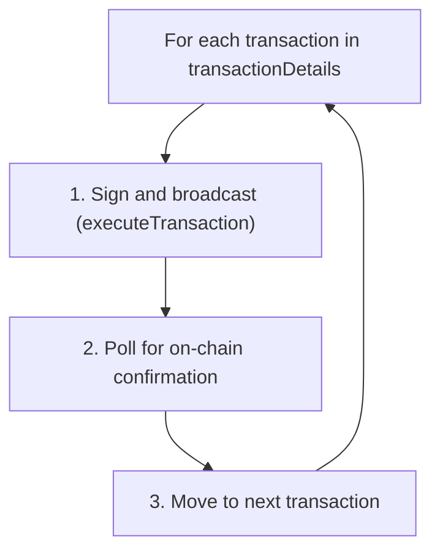

# Transaction Signing: Multiple Signatures and Mid-Flow Signing

A route returned by the Skip API can require **more than one signature** from the user, and those signatures may not all happen upfront — some occur **mid-flow** after earlier transactions have been confirmed on-chain. This document explains when and why.

## How the route maps to signatures

The Skip API route response includes a `txsRequired` field — the number of discrete transactions the user must sign. Each operation in the route has a `txIndex` that maps it to one of those transactions. When consecutive operations have different `txIndex` values, the boundary between them represents a new signature.

The client library computes `signRequired` on each operation:

```typescript
// packages/client/src/utils/clientType.ts
const signRequired = (() => {
  if (index === 0) return false;
  if (prevOperation && operation.txIndex > prevOperation.txIndex) return true;
  return false;
})();
```

If `txsRequired === 1`, the entire route executes in a single transaction and the user signs once. If `txsRequired >= 2`, the user will be prompted to sign again mid-flow.

## When 2 signatures are required

Two (or more) signatures are needed when the route spans multiple chains and the path cannot be executed with a single initial transaction. Common scenarios:

| Scenario | Example | Why 2 signatures |
|---|---|---|
| **Cross-ecosystem route** | Cosmos → EVM or EVM → Cosmos | The source-chain tx initiates a bridge; once funds arrive on the destination chain, a second tx (swap, transfer, etc.) must be signed on that chain. |
| **Multi-hop with signing on an intermediate chain** | EVM chain A → EVM chain B → EVM chain C | If the route requires an action on chain B (e.g., a swap) before bridging to chain C, the user must sign on chain B after the first bridge completes. |
| **Destination-chain swap** | Bridge from chain A, then swap on chain B | The bridge tx is signed on chain A. After the bridge completes, a swap tx must be signed on chain B. |

The widget warns users before executing multi-signature routes:

```
"This transaction requires {N} signatures. Please leave this window open
until both steps have been authorized."
```

This is shown via `WarningPageTradeAdditionalSigningRequired` when `route.txsRequired > 1`.

## When signatures happen mid-flow (not upfront)

Transactions are executed **sequentially** — each transaction is signed, broadcast, and confirmed on-chain before the next one starts. The orchestration loop in `subscribeToRouteStatus.ts` drives this:



Whether a signature happens upfront or mid-flow depends on the chain type:

### EVM transactions — always mid-flow

EVM transactions are **never batch-signed upfront**. The batch-signing loop in `executeTransactions.ts` only handles Cosmos and SVM transactions — there is no `evmTx` branch. Every EVM transaction is signed exactly when its turn comes in the sequential execution loop.

This means for any route involving an EVM chain as a non-first transaction, the user will be prompted to sign mid-flow after earlier transactions complete.

### Cosmos transactions — upfront when possible, mid-flow as fallback

When `batchSignTxs` is enabled (the default), the client attempts to batch-sign all Cosmos transactions upfront before execution begins. However, batch signing is **skipped** for a Cosmos tx if:

1. The user does not yet have an address for that chain (the account hasn't been created on-chain).
2. `getAccountNumberAndSequence` fails for the address (e.g., the account has no on-chain state yet because it will only be funded by an earlier transaction in the route).

In these cases, the Cosmos transaction falls through to the normal `executeTransaction` path and is signed mid-flow when its turn arrives.

### SVM (Solana) transactions — upfront when possible

SVM transactions follow the same pattern as Cosmos: they are batch-signed upfront when `batchSignTxs` is enabled. Unlike Cosmos, there is no account-existence check — SVM transactions are always batch-signed if the option is on.

## ERC-20 approvals: an extra signature within a single EVM transaction

Even when a route has `txsRequired === 1`, an EVM transaction may still prompt the user for **two wallet interactions** if an ERC-20 token approval is needed.

Before executing the swap/transfer, `executeEvmTransaction` checks `evmTx.requiredErc20Approvals`. If the current allowance is insufficient:

1. **Approval tx** — The user signs an `approve` call on the token contract. The route status changes to `"allowance"` and the widget shows "Approving allowance".
2. **Main tx** — After the approval is confirmed on-chain, the actual swap/transfer transaction is sent for signing.

This means a user swapping an ERC-20 token for the first time on a DEX will see two wallet popups in sequence, even though the route only counts as 1 transaction in `txsRequired`. The approval count is not reflected in `txsRequired` because approvals are handled transparently within the EVM execution step.

## Address requirements and `requiredChainAddresses`

The route's `requiredChainAddresses` array lists every chain that needs a user address — not just source and destination, but also intermediate chains where funds may land if a transfer fails (recovery addresses) or where the user must sign a transaction.

The widget resolves these in three states:

| State | Button label | Meaning |
|---|---|---|
| `destinationAddressUnset` | "Set destination address" or "Set second signing address" | The destination chain address is missing. If `signRequired` is true for the last operation and `txsRequired === 2`, the label becomes "Set second signing address" to signal that this address will be used for signing, not just receiving. |
| `recoveryAddressUnset` | "Set intermediary address" | An intermediate chain address is missing. This is a recovery address for failed IBC transfers. |
| `ready` | "Confirm" | All required addresses are set. |

## Summary

| Aspect | Detail |
|---|---|
| `txsRequired` | Number of discrete transactions the user must sign. Comes from the route API response. |
| `signRequired` per operation | `true` when an operation's `txIndex` is greater than the previous operation's, marking a new signature boundary. |
| EVM signing | Always mid-flow. Never batch-signed. |
| Cosmos signing | Batch-signed upfront by default; falls back to mid-flow if the account doesn't exist on-chain yet. |
| SVM signing | Batch-signed upfront by default. |
| ERC-20 approvals | Extra wallet interaction within a single EVM tx. Not counted in `txsRequired`. |
| Multi-sig warning | Shown when `txsRequired > 1`. User must keep the window open for all signing steps. |

## Key files

| File | Role |
|---|---|
| `packages/client/src/utils/clientType.ts` | Computes `signRequired` per operation based on `txIndex` boundaries |
| `packages/client/src/private-functions/executeTransactions.ts` | Batch-signing logic (Cosmos/SVM upfront) and per-tx execution fallback |
| `packages/client/src/private-functions/evm/executeEvmTransaction.ts` | ERC-20 approval flow + EVM tx signing (always mid-flow) |
| `packages/client/src/public-functions/subscribeToRouteStatus.ts` | Sequential execute → poll loop that drives mid-flow signing |
| `packages/widget/src/pages/SwapExecutionPage/SwapExecutionButton.tsx` | UI for multi-sig warning, address-setting prompts, signing states |
| `packages/widget/src/pages/SwapExecutionPage/useSwapExecutionState.ts` | State machine mapping route status to UI states (approving, signaturesRemaining, etc.) |
| `packages/widget/src/pages/ErrorWarningPage/WarningPage/WarningPageTradeAdditionalSigningRequired.tsx` | Warning dialog shown when `txsRequired > 1` |
