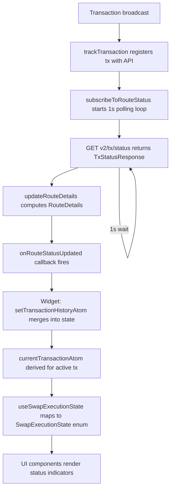
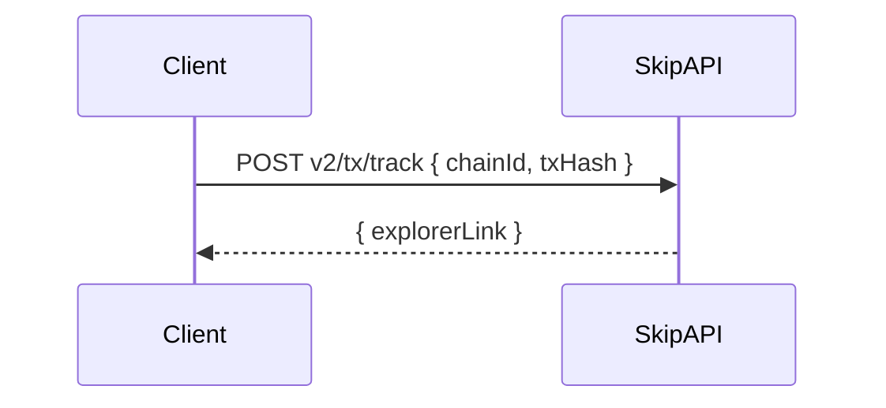
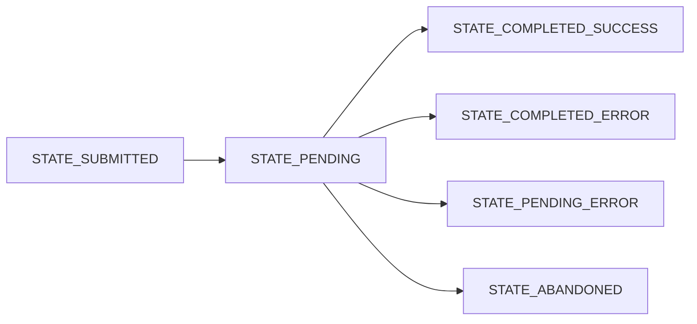
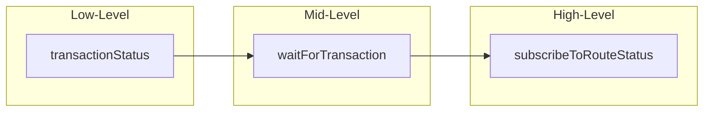
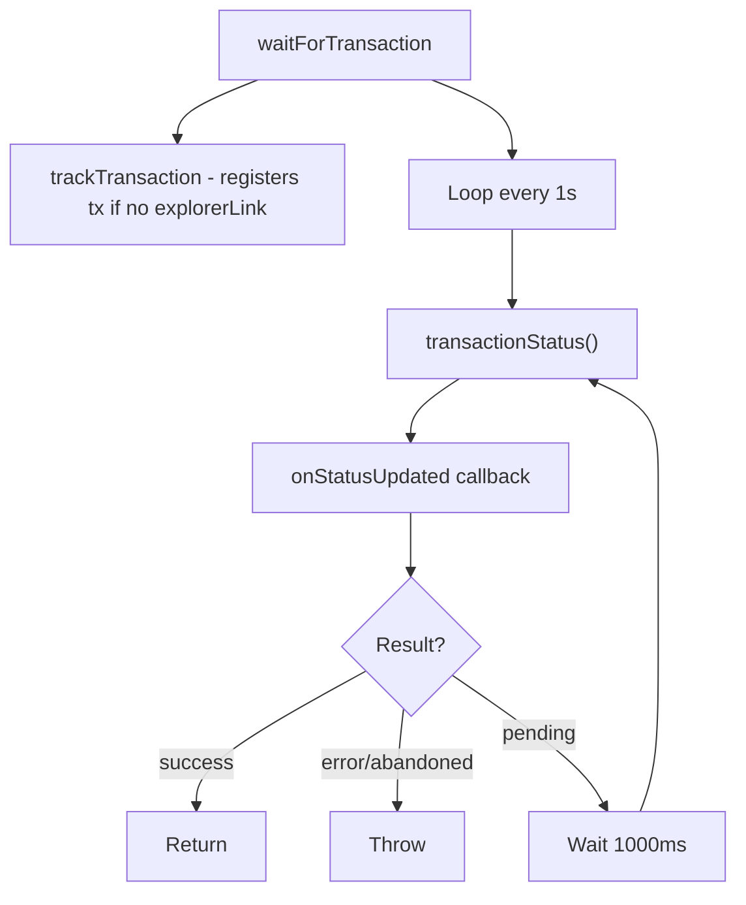
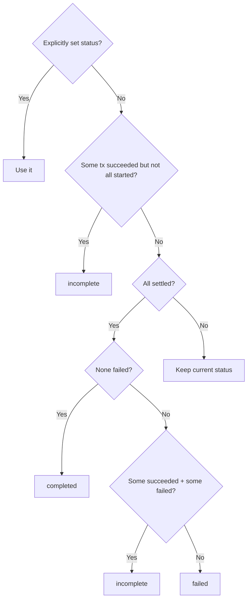
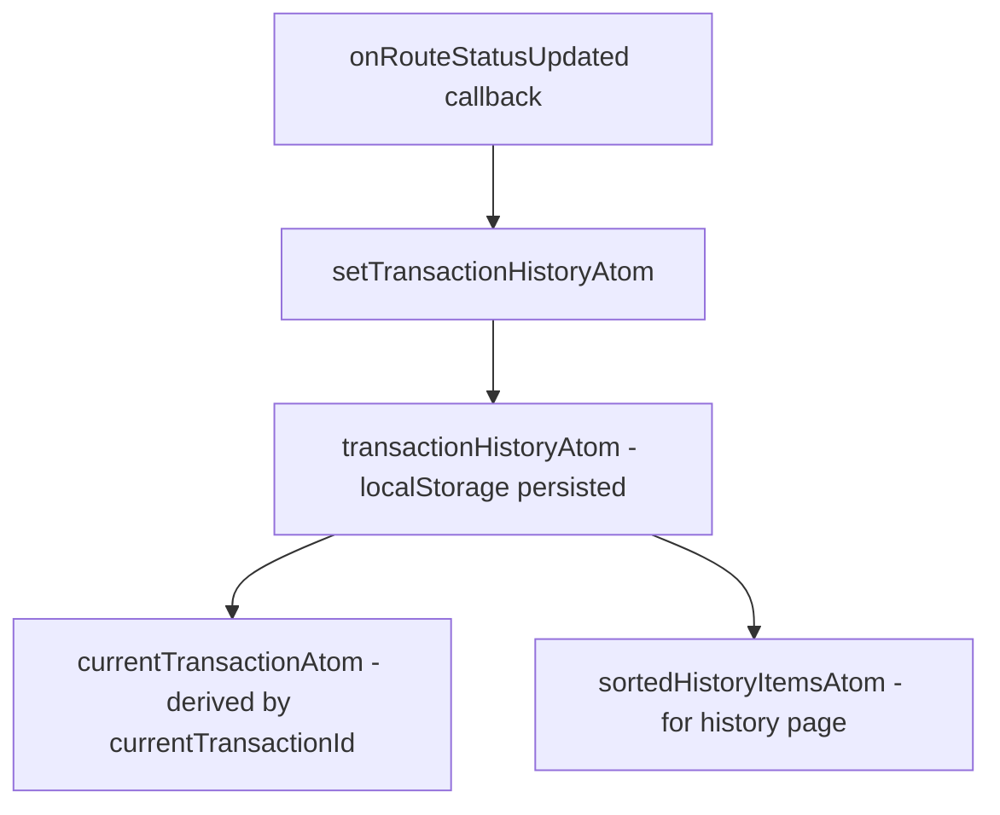
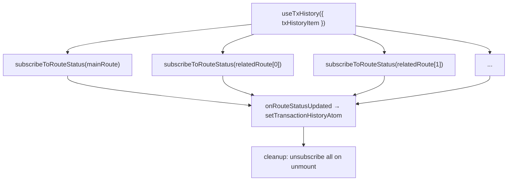
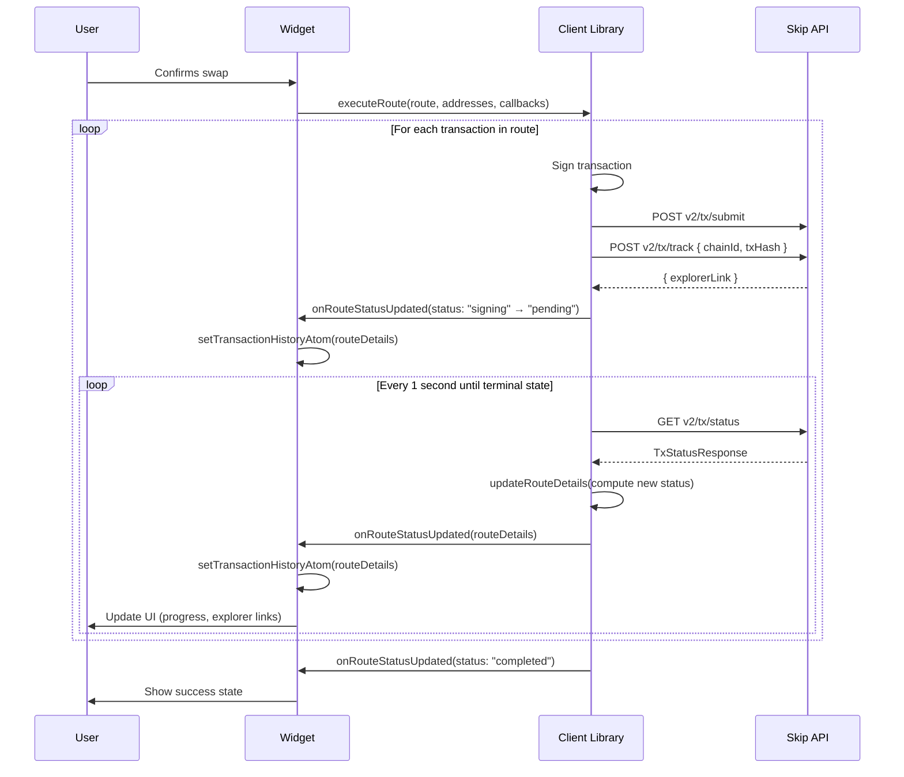

# Status Tracking — Skip Go Client Library through Widget

## High-Level Overview



---

## Detailed Flow

### 1. Registering a Transaction

After a transaction is broadcast, the client registers it with the Skip API so the backend can begin indexing it.

**Endpoint:** `POST v2/tx/track`



`trackTransaction` in `packages/client/src/api/postTrackTransaction.ts` wraps this call with configurable polling/retry to handle cases where the API hasn't indexed the tx yet:

| Option | Default | Description |
|--------|---------|-------------|
| `maxRetries` | 10 | Maximum polling attempts |
| `retryInterval` | 1000ms | Base interval between retries |
| `backoffMultiplier` | 2.5 | Exponential backoff factor |

**Backoff formula:** `delay = retryInterval × (backoffMultiplier ^ attempt)`

---

### 2. Polling for Status

Once tracked, the client polls for status updates.

**Endpoint:** `GET v2/tx/status?chainId=...&txHash=...`

The response (`TxStatusResponse`) contains:

| Field | Type | Description |
|-------|------|-------------|
| `state` | `TransactionState` | Overall transaction state |
| `transfers` | `Transfer[]` | Per-transfer status with detailed state |
| `transferSequence` | `TransferEvent[]` | Ordered list of cross-chain transfer events |
| `transferAssetRelease` | `TransferAssetRelease` | Info about where/when assets are released |
| `error` | `StatusError` | Error details if failed |

#### Transaction States



| State | Meaning |
|-------|---------|
| `STATE_SUBMITTED` | Submitted but not yet on-chain |
| `STATE_PENDING` | On-chain, transfers in progress |
| `STATE_COMPLETED_SUCCESS` | All transfers succeeded |
| `STATE_COMPLETED_ERROR` | A transfer failed |
| `STATE_PENDING_ERROR` | Will fail; error is propagating |
| `STATE_ABANDONED` | Tracking abandoned (>10min stall or >5min no block) |

---

### 3. Client-Level Abstractions

The client provides three levels of abstraction over raw status polling:



#### `transactionStatus` — Single poll

Direct call to `GET v2/tx/status`. Returns `TxStatusResponse`.

**File:** `packages/client/src/api/postTransactionStatus.ts`

#### `waitForTransaction` — Poll until final

Loops with a fixed 1-second interval until a terminal state is reached. Supports cancellation.

**File:** `packages/client/src/public-functions/waitForTransaction.ts`

Terminal states: `STATE_COMPLETED_SUCCESS`, `STATE_COMPLETED_ERROR`, `STATE_ABANDONED`



#### `subscribeToRouteStatus` — Route-level tracking

Manages status for an entire route (multiple transactions) plus related routes (e.g., gas-on-receive fee routes). This is what the widget uses.

**File:** `packages/client/src/public-functions/subscribeToRouteStatus.ts`

Key behaviors:
- Polls each transaction's status every 1 second
- Computes `RouteDetails` from aggregated transaction statuses
- Tracks `transferEvents` (normalized cross-chain transfer data)
- Handles related routes (gas routes) and waits for all to reach final state
- Fires `onRouteStatusUpdated` callback only when status actually changes (JSON diff)
- Supports cancellation via returned `unsubscribe` function

---

### 4. RouteDetails — The Core Status Object

`RouteDetails` is the central data structure that flows from client to widget.

**File:** `packages/client/src/public-functions/subscribeToRouteStatus.ts`

```typescript
type RouteDetails = {
  id: string;
  timestamp: number;
  status: RouteStatus;
  route: SimpleRoute;
  txsRequired: number;
  txsSigned: number;
  transactionDetails: TransactionDetails[];
  transferEvents: ClientTransferEvent[];
  transferAssetRelease?: TransferAssetRelease;
  relatedRoutes?: Partial<RouteDetails>[];
  userAddresses: UserAddress[];
};
```

#### Route Status

`RouteStatus` is computed from the aggregated state of all transactions in the route:

| Status | Condition |
|--------|-----------|
| `"unconfirmed"` | Initial state, no transactions signed |
| `"validating"` | Validating gas balances |
| `"allowance"` | Waiting for ERC-20 approval |
| `"signing"` | Waiting for user signature |
| `"pending"` | Transactions broadcasting/in-flight |
| `"completed"` | All transactions succeeded |
| `"failed"` | All transactions failed |
| `"incomplete"` | Some succeeded, some failed or not started |

The computation logic in `updateRouteDetails`:



#### Transfer Events

Each cross-chain hop produces a `ClientTransferEvent`:

```typescript
type ClientTransferEvent = {
  fromChainId: string;
  toChainId: string;
  state: TransferState | AxelarTransferState | ...;
  status: TransferEventStatus;  // simplified
  fromExplorerLink?: string;
  toExplorerLink?: string;
  fromTxHash?: string;
  toTxHash?: string;
  transferType: TransferType;
  durationInMs?: number;
};
```

`TransferEventStatus` simplifies bridge-specific states into:

| Status | Bridge States |
|--------|---------------|
| `"pending"` | `TRANSFER_PENDING`, `CCTP_TRANSFER_SENT`, `AXELAR_TRANSFER_PENDING_CONFIRMATION`, etc. |
| `"completed"` | `TRANSFER_SUCCESS`, `CCTP_TRANSFER_RECEIVED`, `AXELAR_TRANSFER_SUCCESS`, etc. |
| `"failed"` | All other states |

Supported bridge types: IBC, Axelar, CCTP, Hyperlane, OPInit, GoFast, Stargate, Eureka, LayerZero.

---

### 5. Widget Integration

#### State Layer

**File:** `packages/widget/src/state/history.ts`



`transactionHistoryAtom` stores up to 400 `RouteDetails` items in localStorage, sorted by timestamp.

`setTransactionHistoryAtom` merges updates by `id` — if the route already exists it patches it, otherwise it appends and sets `currentTransactionId` (for main routes only, not related/gas routes).

`currentTransactionAtom` derives the active transaction by looking up `currentTransactionId` in the history array.

#### Subscription Hook

**File:** `packages/widget/src/hooks/useTxHistory.ts`

`useTxHistory` subscribes to status updates for a transaction and its related routes:



Each route (main + related) gets its own independent polling subscription. Deduplication is handled via a `subscribedIdsRef` set.

#### UI State Mapping

**File:** `packages/widget/src/pages/SwapExecutionPage/useSwapExecutionState.ts`

`useSwapExecutionState` maps `RouteStatus` → `SwapExecutionState` for the UI:

| `RouteStatus` | `SwapExecutionState` | UI Behavior |
|----------------|----------------------|-------------|
| `"failed"` | `pendingError` | Error page shown |
| `"completed"` | `confirmed` | Success state |
| `"pending"` | `pending` | Progress indicators |
| `"allowance"` | `approving` | Approval prompt |
| `"validating"` | `validatingGasBalance` | Gas validation |
| `"signing"` (single tx) | `waitingForSigning` | Signature prompt |
| `"signing"` (multi tx) | `signaturesRemaining` | Shows "N of M signed" |

Additional pre-execution states: `destinationAddressUnset`, `recoveryAddressUnset`, `ready`, `pendingGettingAddresses`, etc.

#### Visual Status Indicators

**File:** `packages/widget/src/pages/SwapExecutionPage/SwapExecutionPageRouteDetailedRow.tsx`

Each operation row in the detailed view renders a status indicator:

| Transfer Event Status | Visual |
|----------------------|--------|
| `"completed"` | Green border |
| `"failed"` | Red border |
| `"pending"` | Animated rotating border |

The simple view (`SwapExecutionPageRouteSimple`) shows source/destination with collapsed status. The detailed view (`SwapExecutionPageRouteDetailed`) shows every operation individually.

---

### 6. Error Handling and Timeouts

#### Transaction Failure

**File:** `packages/widget/src/pages/SwapExecutionPage/useHandleTransactionFailed.tsx`

Monitors `currentTransaction.status` for `"failed"` or `"incomplete"`. When detected:
- Checks `transferAssetRelease` for information about where assets ended up
- Navigates to an error page with recovery options

#### Transaction Timeout

**File:** `packages/widget/src/pages/SwapExecutionPage/useHandleTransactionTimeout.tsx`

If a transaction stays in `"pending"` beyond `estimatedRouteDurationSeconds × 3`, the widget shows a timeout error page.

---

### 7. End-to-End Sequence



---

## Key Files Reference

| File | Layer | Purpose |
|------|-------|---------|
| `packages/client/src/api/postTrackTransaction.ts` | Client | Register tx for tracking |
| `packages/client/src/api/postTransactionStatus.ts` | Client | Poll tx status |
| `packages/client/src/public-functions/waitForTransaction.ts` | Client | Poll until terminal state |
| `packages/client/src/public-functions/subscribeToRouteStatus.ts` | Client | Route-level status management |
| `packages/client/src/utils/clientType.ts` | Client | Transfer event normalization, status simplification |
| `packages/widget/src/state/history.ts` | Widget/State | Transaction history atoms |
| `packages/widget/src/hooks/useTxHistory.ts` | Widget/Hook | Subscribe to status updates |
| `packages/widget/src/pages/SwapExecutionPage/useSwapExecutionState.ts` | Widget/UI | Map RouteStatus → SwapExecutionState |
| `packages/widget/src/pages/SwapExecutionPage/useHandleTransactionFailed.tsx` | Widget/UI | Handle failure states |
| `packages/widget/src/pages/SwapExecutionPage/useHandleTransactionTimeout.tsx` | Widget/UI | Handle timeout states |
| `packages/widget/src/pages/SwapExecutionPage/SwapExecutionPageRouteDetailedRow.tsx` | Widget/UI | Visual status indicators |
