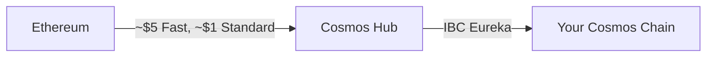
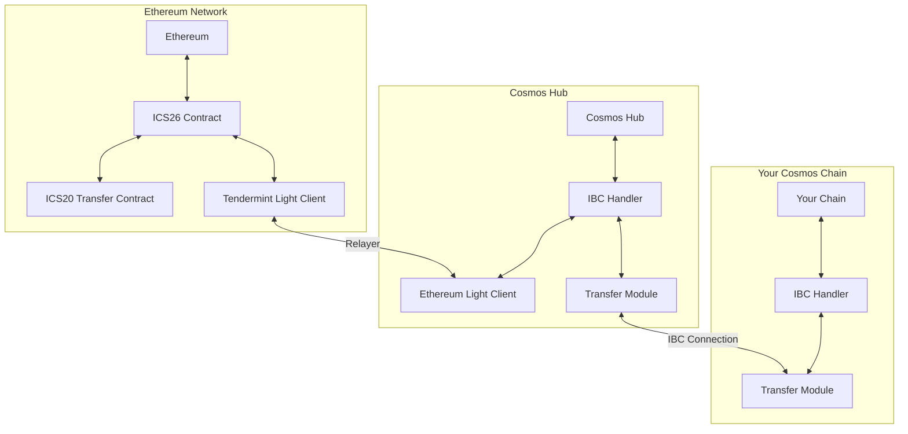

## Native IBC Security Model

Eureka implements the full IBC light client security model, providing trust-minimized verification of cross-chain transactions:

- **Light Client Verification**: Each chain runs a light client of the other chain, enabling cryptographic verification of state transitions. On the Ethereum side we use Succinct's SP1 zero-knowledge proofs for efficient verification
- **No Multisig Dependencies**: Unlike many bridge solutions, Eureka doesn't rely on trusted validator sets or multisigs for security
- **Permissionless Access**: Anyone can connect to the IBC network and Ethereum, as long as your chain has an IBC implementation, classic or v2
- **Minimal Infrastructure Overhead, no ongoing costs**: Relaying, proving and routing between the Cosmos Hub and Ethereum onto your chain is handled by the smart relayer, paid for by end users. Simply maintain an IBC classic connection to the Cosmos Hub

## Performance and Cost Efficiency

- **Optimized Gas Consumption**: Transfer from Ethereum to your chain, via Cosmos Hub for approximately \$5 using fast mode and less than \$1 for standard transfers
- **Fast Finality**: Assets arrive on destination chains in seconds, regardless of source chain finality times

## Native Asset Representation

- **Bank Module Integration**: Received assets live directly in the bank module as native tokens
- **No Wrapped Tokens**: Assets are not wrapped or suffixed with bridge-specific identifiers (e.g., no ETH.axl)
- **ERC20 Compatibility**: Assets can be easily represented as ERC20s in the future without conversion complexity

## How Eureka Works

Eureka connects blockchains through a combination of:

1. **IBC Protocol v2**: The standardized communication layer that defines packet formats and verification logic
2. **Solidity Implementation**: Smart contracts deployed on Ethereum and EVM chains that implement the IBC protocol (Other smart contract chains to come)
3. **Light Clients**: Each chain runs a light client of the other chain to verify state transitions. On Ethereum, this uses SP1 zero-knowledge proofs for gas-efficient verification
4. **Relayers**: IBC v2 uses relayers to send messages between chains. We facilitate and operate the relaying infrastructure for Eureka for you.

<Note>
  The IBC protocol guarantees that a packet delivered on the destination chain
  was definitely sent from the source chain, using cryptographic verification
  rather than trusted third parties.
</Note>

## Permissioned Relay

The initial rollout of IBC Eureka will use permissioned relayers for additional safety and security guarantees. 
The IBC light clients will be used in the same way as when IBC is permissionless, the permissioning only means that liveness is 
dependent on the permissioned relay set. Permissioning will be removed in the near future. 

## Architecture Overview

